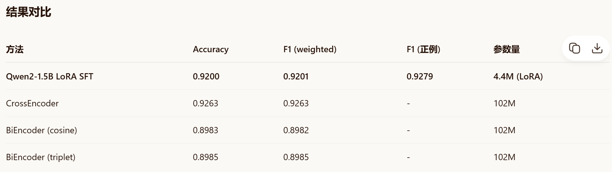

* 项目使用的训练数据：/data/bq_corpus

* 训练结果
>

* 遇到的问题
> 使用了全量微调，进行了几次实验修改都不好。
使用设备: cuda  |  微调模式: 全量微调
训练集: 5000 条（正2500+负2500，平衡采样）| 验证集（前500条）: 500 条

> 加载 tokenizer: /root/autodl-tmp/basic-model/Qwen/Qwen2-1.5B
加载 base model: /root/autodl-tmp/basic-model/Qwen/Qwen2-1.5B
Loading weights: 100%|██████████████████████████████████████████████████████████████████████████████████████████████████████████████████████████████████████| 338/338 [00:01<00:00, 240.07it/s]
trainable params: 1,543,714,304 || all params: 1,543,714,304 || trainable%: 100.0000
总训练步数: 937（batch=4, grad_accum=4, epochs=3, lr=2e-05）

> Epoch 1/3 | train_loss=0.2718  val_loss=0.1557 | 166s                                                                                                                                          
Writing model shards: 100%|██████████████████████████████████████████████████████████████████████████████████████████████████████████████████████████████████████| 1/1 [00:06<00:00,  6.30s/it]
  ✓ 最优完整模型已保存 → /root/autodl-tmp/week08/outputs/sft_full_ckpt  (val_loss=0.1557)
Epoch 2/3 | train_loss=1.3714  val_loss=2.7309 | 165s                                                                                                                                          
Epoch 3/3 | train_loss=3.0931  val_loss=3.4535 | 166s

