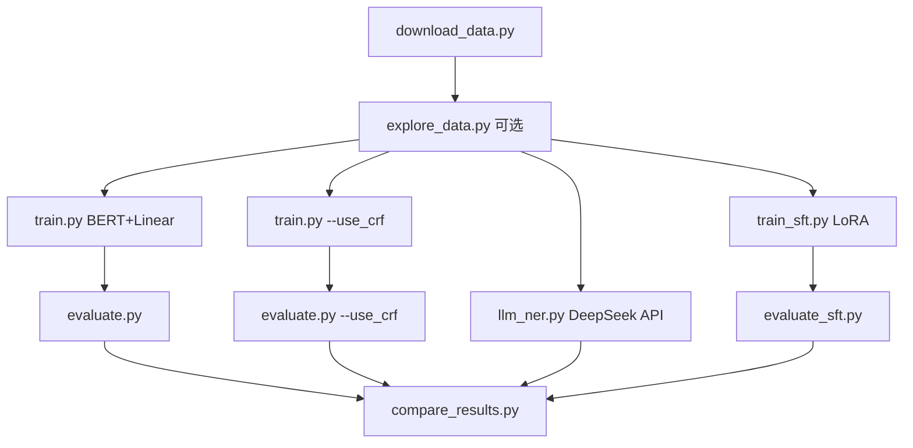

# 基于 peoples_daily 数据集实现序列标注模型训练

本项目在 **人民日报 NER（peoples_daily）** 数据集上，系统对比了多种命名实体识别（NER）方案：传统序列标注（BERT + Linear / BERT + CRF）、大模型 API 提示（DeepSeek zero-shot / few-shot）、以及本地小模型 SFT（Qwen2-0.5B + LoRA）。实验在 **联想小新 CPU** 环境下完成，针对笔记本 CPU 做了训练加速与稳定性优化。

---

## 目录

- [1. 项目背景与目标](#1-项目背景与目标)
- [2. 数据集说明](#2-数据集说明)
- [3. 项目结构](#3-项目结构)
- [4. 环境配置](#4-环境配置)
- [5. 完整实验流程](#5-完整实验流程)
- [6. CPU 训练优化策略](#6-cpu-训练优化策略)
- [7. 各方案原理简介](#7-各方案原理简介)
- [8. 训练过程与日志](#8-训练过程与日志)
- [9. 评估结果汇总](#9-评估结果汇总)
- [10. 结果分析与讨论](#10-结果分析与讨论)
- [11. 最终结论](#11-最终结论)
- [12. 产出文件索引](#12-产出文件索引)
- [13. 常见问题](#13-常见问题)

---

## 1. 项目背景与目标

### 1.1 任务定义

命名实体识别（Named Entity Recognition, NER）是序列标注问题的典型应用：对输入文本的每个字/词预测一个标签，从而识别出人名（PER）、组织机构（ORG）、地名（LOC）等实体。

本项目采用 **BIO 标注体系**：

| 标签 | 含义 |
|------|------|
| `O` | 非实体 |
| `B-PER` / `I-PER` | 人名起止 |
| `B-ORG` / `I-ORG` | 机构名起止 |
| `B-LOC` / `I-LOC` | 地名起止 |

共 **7 个标签**。

### 1.2 实验目标

1. 在 peoples_daily 数据集上训练并评估 **BERT 序列标注模型**（Linear 头 vs CRF 解码）
2. 对比 **DeepSeek API** 的 zero-shot / few-shot 提示方案
3. 尝试 **Qwen2-0.5B-Instruct + LoRA SFT** 生成式 NER
4. 在 CPU 笔记本上完成可复现的端到端流程，并汇总各方案优劣

### 1.3 实验环境

| 项目 | 配置 |
|------|------|
| 硬件 | 联想小新（CPU，8 线程） |
| 操作系统 | Windows 10 |
| Python | 3.x |
| 深度学习框架 | PyTorch 2.x + Transformers 5.x |
| 预训练模型 | 本地 `bert-base-chinese`、`Qwen2-0.5B-Instruct` |

---

## 2. 数据集说明

### 2.1 数据来源

主数据集：**人民日报 NER（peoples_daily）**，BIO 格式，每条样本包含：

```json
{
  "tokens": ["毛", "泽", "东", "主", "席", "在", "北", "京", "..."],
  "ner_tags": ["B-PER", "I-PER", "I-PER", "O", "O", "O", "B-LOC", "I-LOC", "..."]
}
```

### 2.2 数据规模

| 划分 | 样本数 |
|------|--------|
| 训练集 `train.json` | 20,864 |
| 验证集 `validation.json` | 2,318 |
| 测试集 `test.json` | 4,636 |

实体类型仅 3 类：**PER（人名）、ORG（机构）、LOC（地名）**。

### 2.3 数据特点（影响建模）

通过 `explore_data.py` 可生成统计图（`outputs/figures/`）：

- **类别极度不均衡**：约 88% 的标签为 `O`，模型容易退化为「全预测 O」
- **文本较短**：平均约 70 字，P95 约 128 字 → `max_length=128` 足够
- **实体长度偏短**：多数实体为 2~4 字

数据路径：`data/peoples_daily/`

---

## 3. 项目结构

```
序列标注项目/
├── data/
│   ├── peoples_daily/          # 主数据集（train / validation / test）
│   └── cluener/                # 备用数据集（可选）
├── pretrain_models/
│   ├── bert-base-chinese/      # 本地 BERT
│   └── Qwen2-0.5B-Instruct/    # 本地 Qwen（SFT 用）
├── src/                        # BERT NER 核心代码
│   ├── paths.py                # 路径与资源校验
│   ├── runtime.py              # CPU/GPU 运行时优化
│   ├── dataset.py              # 数据加载、BIO 解析、类别权重
│   ├── model.py                # BertNER / BertCRFNER
│   ├── train.py                # BERT 训练
│   ├── evaluate.py             # BERT 评估
│   ├── compare_results.py      # 多方案结果汇总
│   ├── explore_data.py         # 数据探索与可视化
│   └── download_data.py        # 数据下载
├── src_llm/                    # 大模型相关
│   ├── llm_ner.py              # DeepSeek API zero/few-shot
│   ├── train_sft.py            # Qwen LoRA SFT 训练
│   └── evaluate_sft.py         # SFT 模型评估
├── outputs/
│   ├── checkpoints/            # BERT 最优权重 best_linear.pt / best_crf.pt
│   ├── sft_adapter/            # LoRA adapter
│   ├── logs/                   # 训练与评估 JSON 日志
│   └── figures/                # 数据探索图表
├── requirements.txt
└── README.md                   # 本文件
```

---

## 4. 环境配置

### 4.1 安装依赖

```powershell
cd "E:\AI课学习\week7序列标注问题\序列标注项目"
pip install -r requirements.txt
```

主要依赖：`torch`、`transformers`、`pytorch-crf`、`seqeval`、`peft`、`openai`、`matplotlib`

### 4.2 本地模型

确保以下目录完整（含权重文件）：

- `pretrain_models/bert-base-chinese/`（`config.json`、`vocab.txt`、`model.safetensors` 等）
- `pretrain_models/Qwen2-0.5B-Instruct/`（SFT 需要完整权重）

### 4.3 API 密钥（LLM 方案）

DeepSeek（`llm_ner.py` 默认）：

```powershell
$env:DEEPSEEK_API_KEY = "sk-你的密钥"
```

---

## 5. 完整实验流程



### 5.1 数据准备

```powershell
cd src
python download_data.py --skip_cluener
python explore_data.py
```

生成可视化图片进行数据分析：


### 5.2 BERT + Linear

```powershell
cd src
python train.py --num_train 3000 --epochs 3
python evaluate.py
```

### 5.3 BERT + CRF

```powershell
python train.py --use_crf --num_train 3000 --epochs 3
python evaluate.py --use_crf
```

### 5.4 DeepSeek API NER

```powershell
cd ..\src_llm
$env:DEEPSEEK_API_KEY = "sk-xxx"
python llm_ner.py --n_samples 50
```

### 5.5 Qwen2 SFT（LoRA）

```powershell
python train_sft.py --num_train 1000 --max_length 128 --val_samples 50
python evaluate_sft.py
```

### 5.6 汇总对比

```powershell
cd ..\src
python compare_results.py
```

---

## 6. CPU 训练优化策略

针对联想小新等 CPU 环境，项目在 `src/runtime.py` 中实现了 **自动快速模式**（不加 `--full` 时生效）：

### 6.1 BERT NER 快速模式

| 参数 | CPU 默认值 | 说明 |
|------|-----------|------|
| `num_train` | 8000（可手动指定 3000） | 训练集子采样 |
| `epochs` | 3 | 至少 3 epoch，避免 F1 过低 |
| `freeze_bert` | True | 冻结 BERT，只训分类头 |
| `head_lr` | 1e-3 | 分类头学习率 |
| `batch_size` | 16 | |
| 动态 padding | 开启 | 按 batch 内实际长度 padding，显著加速 |
| 类别权重 | 自动计算 | 缓解 O 标签过多导致的全 O 预测 |

**关键修复**：早期实验因类别不均衡 + 学习率过低，出现 `val_entity_f1 ≈ 0.003`（模型全预测 O）。引入 **class_weight** 并将 **head_lr 提升至 1e-3** 后，验证 F1 恢复正常。

### 6.2 LLM SFT 快速模式

| 参数 | CPU 默认值 | 本次实验使用 |
|------|-----------|-------------|
| `num_train` | 2000 | **1000** |
| `epochs` | 1 | 1 |
| `val_samples` | 100 | **50** |
| `max_length` | 256 | **128** |
| `batch_size` | 2 | 2 |
| `grad_accum` | 8 | 8（等效 batch=16） |
| 微调方式 | LoRA | LoRA（约 0.22% 参数可训） |

---

## 7. 各方案原理简介

### 7.1 BERT + Linear

```
输入文本 → BERT 编码 → 每个 token 的 hidden state → Linear 分类头 → 7 类 logits
损失函数：CrossEntropy（带类别权重）
解码：逐 token argmax
```

**优点**：结构简单、训练快  
**缺点**：独立预测每个标签，可能产生非法 BIO 序列（如 `O` 后直接 `I-PER`）

### 7.2 BERT + CRF

在 Linear 输出之上叠加 **条件随机场（CRF）** 层，建模标签之间的转移约束；解码时使用 **Viterbi 算法** 求全局最优标签序列。

**优点**：F1 更高，非法 BIO 转移显著减少  
**缺点**：训练与解码更慢（CPU 上每 epoch 约 20 分钟）

### 7.3 DeepSeek API（zero-shot / few-shot）

通过 Prompt 让大模型直接输出 JSON 格式实体列表，无需训练。

- **zero-shot**：仅任务说明，无示例
- **few-shot**：额外提供 3 个标注示例

评估时将 JSON 解析为 span，计算与 BERT 一致的 entity-level F1。

### 7.4 Qwen2-0.5B SFT（LoRA）

将 NER 转化为 **指令微调** 任务：输入新闻句子，模型生成 `{"entities": [...]}`  JSON。

使用 LoRA 只微调 attention 投影层（约 108 万参数），在 CPU 上约 2 小时/1000 条。

---

## 8. 训练过程与日志

### 8.1 BERT + Linear（3000 条，3 epoch，冻结 BERT）

| Epoch | Train Loss | Val Loss | Val Entity F1 | 耗时 |
|-------|-----------|----------|---------------|------|
| 1 | 0.6706 | 0.2951 | **0.5215** | 911 s |
| 2 | 0.2922 | 0.2475 | **0.5468** | 800 s |
| 3 | 0.2600 | 0.2383 | **0.5589** | 798 s |

- 最优 checkpoint：`outputs/checkpoints/best_linear.pt`（epoch=3，val_f1=0.5589）
- 日志：`outputs/logs/train_linear.json`

### 8.2 BERT + CRF（3000 条，3 epoch，冻结 BERT）

| Epoch | Train Loss | Val Loss | Val Entity F1 | 耗时 |
|-------|-----------|----------|---------------|------|
| 1 | 28.1662 | 4.6783 | **0.5994** | 1172 s |
| 2 | 4.5363 | 3.6829 | **0.6820** | 1202 s |
| 3 | 3.8897 | 3.4508 | **0.6995** | 1436 s |

- 最优 checkpoint：`outputs/checkpoints/best_crf.pt`（epoch=3，val_f1=0.6995）
- 日志：`outputs/logs/train_crf.json`
- CRF 的 train_loss 数值较大属正常现象（CRF 层 log-likelihood 量级不同）

### 8.3 DeepSeek API（deepseek-chat，50 条验证集采样）

- 每条样本调用 2 次 API（zero-shot + few-shot）
- 日志：`outputs/logs/eval_llm.json`

### 8.4 Qwen2-0.5B LoRA SFT（1000 条，max_length=128，1 epoch）

| Epoch | Train Loss | Val Loss | 耗时 |
|-------|-----------|----------|------|
| 1 | **NaN** | 0.1132 | 2878 s（约 48 分钟） |

- checkpoint：`outputs/sft_adapter/`
- 日志：`outputs/logs/train_sft.json`
- **注意**：训练 loss 出现 NaN，但验证 loss 有限，模型仍被保存；后续评估效果较差（见下文分析）

---

## 9. 评估结果汇总

### 9.1 测试集完整评估（BERT，4636 条）

| 方案 | Precision | Recall | **F1** | 非法 BIO 序列 |
|------|-----------|--------|--------|--------------|
| **BERT + Linear** | 0.4480 | 0.7208 | **0.5526** | 3537 / 4636 句 |
| **BERT + CRF** | 0.6516 | 0.7293 | **0.6882** | 1243 / 4636 句 |

- Linear 测试集各类 F1（来自 evaluate 终端输出）：PER **0.83**、LOC **0.64**、ORG **0.29**
- CRF 相比 Linear：**F1 提升 +0.1356**，Precision 提升明显
- 日志：`outputs/logs/eval_linear_test.json`、`outputs/logs/eval_crf_test.json`

### 9.2 验证集采样评估（LLM / SFT，50 条，seed=42）

| 方案 | Precision | Recall | **F1** | 备注 |
|------|-----------|--------|--------|------|
| **DeepSeek zero-shot** | 0.7421 | 0.4917 | **0.5915** | API 调用 |
| **DeepSeek few-shot** | 0.7532 | 0.4958 | **0.5980** | 3 个示例 |
| **Qwen2-0.5B SFT (LoRA)** | 0.6364 | 0.0959 | **0.1667** | 1000 条 LoRA |
| BERT + CRF（参考，验证集） | 0.7164 | 0.7926 | **0.7526** | 全量验证集 |

> LLM / SFT 结果为验证集 **50 条随机采样**，与 BERT 全量测试集 **不可直接数值对比**，但可用于定性分析各范式差异。

### 9.3 compare_results.py 汇总输出

```
方案                         Precision     Recall         F1       非法序列
-------------------------------------------------------------------
BERT + Linear                 0.4480     0.7208     0.5526       3537
BERT + CRF                    0.6516     0.7293     0.6882       1243
LLM zero-shot (deepseek-chat) 0.7421     0.4917     0.5915        N/A
LLM few-shot (deepseek-chat)  0.7532     0.4958     0.5980        N/A
```

---

## 10. 结果分析与讨论

### 10.1 CRF 显著优于 Linear

| 对比维度 | Linear | CRF | 分析 |
|---------|--------|-----|------|
| 测试 F1 | 0.5526 | **0.6882** | CRF 提升 13.6 个百分点 |
| Precision | 0.4480 | **0.6516** | Linear 高 Recall 低 Precision，存在大量误报 |
| 非法 BIO 序列 | 3537 句 | 1243 句 | CRF 通过转移矩阵约束标签合法性 |

Linear 模型 Recall 较高（0.72）但 Precision 偏低（0.45），说明模型「找得多但错得多」；CRF 在保持 Recall 的同时大幅提高了 Precision。

**ORG 类识别仍是短板**（Linear 测试集 ORG F1 仅 0.29），机构名边界模糊、嵌套复杂是常见难点。

### 10.2 类别不均衡与训练技巧

peoples_daily 中 O 标签占比约 88%。若不处理，模型极易学会「全预测 O」：

- 现象：1 epoch + lr=1e-4 时 val_entity_f1 ≈ 0.003
- 对策：**类别权重（class_weight）** + **提高分类头学习率（1e-3）** + **至少 3 epoch**
- 修复后：80 step 即可达到 val F1 ≈ 0.33，3 epoch 后达 0.56~0.70

### 10.3 DeepSeek API：高 Precision、低 Recall

| 特点 | 表现 |
|------|------|
| Precision | 0.74~0.75（较高） |
| Recall | 0.49~0.50（偏低） |
| few-shot vs zero-shot | F1 几乎无提升（0.5915 → 0.5980） |

大模型倾向于 **保守预测**：识别出的实体较准，但 **漏检较多**。few-shot 示例对 JSON 格式有帮助，但对召回提升有限。

**成本**：50 条 × 2 次调用 = 100 次 API；适合小规模评测，不适合生产全量推理。

### 10.4 Qwen2 SFT 效果不佳的原因分析

本次 SFT 实验 F1 仅 **0.1667**，Recall **0.0959**，主要问题：

1. **训练 loss 为 NaN**：浮点数值不稳定，LoRA 训练可能未有效收敛（需降低 lr 或开启 gradient clipping 加强）
2. **训练数据不足**：1000 条 + 1 epoch 对生成式 NER 偏少
3. **生成式输出冗余**：模型常在 JSON 后继续生成对话内容（如「请提供更多信息…」），干扰 span 匹配
4. **推理极慢**：50 条耗时 1238 s（约 25 s/条），CPU 上 autoregressive 生成代价高

示例（评估日志）：

```
gold: 法国(LOC)
pred: []  （模型输出 {"entities": []} 并附带多余文本）
```

### 10.5 方案综合对比

| 方案 | 测试/采样 F1 | 训练成本 | 推理速度 | 部署难度 | 适用场景 |
|------|-------------|---------|---------|---------|---------|
| BERT + Linear | 0.55（全测试集） | 低（~40 min） | 快 | 低 | 快速基线 |
| **BERT + CRF** | **0.69（全测试集）** | 中（~60 min） | 中 | 低 | **生产首选** |
| DeepSeek few-shot | 0.60（50 条采样） | 无（API 费用） | 慢 | 需联网 | 零样本探索 |
| Qwen2 SFT | 0.17（50 条采样） | 高（~48 min） | 很慢 | 中 | 需进一步调优 |

---

## 11. 最终结论

1. **在 peoples_daily 数据集上，BERT + CRF 是本次实验的最优方案**，测试集 Entity F1 达到 **0.6882**，显著优于 BERT + Linear（0.5526）和 DeepSeek API few-shot（采样 F1 0.5980）。

2. **CRF 解码层的价值**不仅体现在 F1 提升，还体现在 BIO 序列合法性的改善：非法转移从 3537 条降至 1243 条，Precision 从 0.45 提升至 0.65。

3. **针对类别不均衡的 NER 任务，类别权重 + 合适的学习率 + 足够 epoch 是训练成功的关键**；忽略这些问题会导致模型完全失效（全 O 预测）。

4. **大模型 API 方案**（DeepSeek）无需训练即可达到约 0.60 F1，Precision 高但 Recall 不足，适合作为 **零样本基线** 或数据标注辅助，但不替代领域微调模型。

5. **小模型 SFT 方案**在本次 CPU 快速配置下 **未达到预期**（F1 0.17），主要原因包括训练 NaN、数据量不足、生成式输出不稳定。若要改进，建议：全量或更多数据、2~3 epoch、降低学习率、限制 `max_new_tokens`、对输出做严格 JSON 截断。

6. **CPU 笔记本可完成完整实验链路**：通过冻结 BERT、子采样、动态 padding、LoRA 等策略，在联想小新上 BERT 训练约 1 小时、CRF 约 1 小时、SFT 约 50 分钟，具备教学与原型验证价值。

---

## 12. 产出文件索引

| 文件 | 说明 |
|------|------|
| `outputs/checkpoints/best_linear.pt` | BERT+Linear 最优权重 |
| `outputs/checkpoints/best_crf.pt` | BERT+CRF 最优权重 |
| `outputs/sft_adapter/` | Qwen LoRA adapter |
| `outputs/logs/train_linear.json` | Linear 训练曲线 |
| `outputs/logs/train_crf.json` | CRF 训练曲线 |
| `outputs/logs/train_sft.json` | SFT 训练曲线 |
| `outputs/logs/eval_linear_test.json` | Linear 测试集评估 |
| `outputs/logs/eval_crf_test.json` | CRF 测试集评估 |
| `outputs/logs/eval_llm.json` | DeepSeek API 评估 |
| `outputs/logs/eval_sft.json` | SFT 评估详情 |
| `outputs/figures/*.png` | 数据分布可视化 |

---

## 13. 常见问题

### Q1：`evaluate.py` 报 `Unexpected key(s): "class_weight"`

训练 checkpoint 含 `class_weight` buffer，评估时需传入相同结构。已在 `evaluate.py` 中修复：从 checkpoint 读取 `class_weight` 后再 `build_model`。

### Q2：BERT 训练 val F1 接近 0

检查是否使用了 **类别权重** 和 **head_lr=1e-3**，并确保 **epochs ≥ 3**。

### Q3：SFT 训练 loss 为 NaN

可尝试：`--lr 1e-4`、减小 `--batch_size`、增加 `--grad_accum`，或使用 `--num_train 2000 --epochs 2` 重新训练。

### Q4：LLM 评估与 BERT 测试集 F1 能否直接比？

不建议。LLM/SFT 基于验证集 **50 条采样**，BERT 基于 **4636 条测试集**。对比时关注趋势和方法论差异，而非绝对数值。

### Q5：如何复现完整实验？

按 [第 5 节](#5-完整实验流程) 顺序执行全部脚本，最后运行 `python compare_results.py` 即可得到与本文一致的汇总表。

---

*实验完成日期：2026 年 6 月 | 数据集：peoples_daily | 运行环境：联想小新 CPU*
