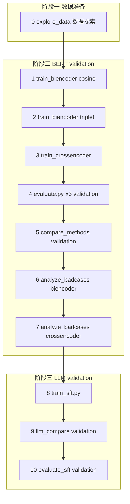

# 基于 LCQMC 文本匹配数据集试验不同方法效果报告

> **实验环境**：联想小新笔记本 · CPU 训练 · Windows 10  
> **数据集**：LCQMC（Large-scale Chinese Question Matching Corpus）  
> **实验日期**：2026 年 6 月  
> **评估范围**：在 **validation 集** 上完成训练选模、方法对比与结论；test 集为可选拓展。  
> **报告说明**：本文档根据完整终端运行日志、训练日志 JSON 及评估输出整理而成，记录从数据探索到 BERT 判别式模型、LLM 生成式方案的全流程实验结果。

---

## 目录

- [1. 项目背景与目标](#1-项目背景与目标)
  - [1.4 评估范围说明（Validation vs Test）](#14-评估范围说明validation-vs-test)
- [2. 数据集说明](#2-数据集说明)
- [3. 项目结构](#3-项目结构)
- [4. 环境配置](#4-环境配置)
- [5. 完整实验流程](#5-完整实验流程)
- [6. CPU 训练优化策略](#6-cpu-训练优化策略)
- [7. 各方案原理简介](#7-各方案原理简介)
- [8. 训练过程与日志](#8-训练过程与日志)
- [9. 评估结果汇总](#9-评估结果汇总)
- [10. Bad Case 分析](#10-bad-case-分析)
- [11. 结果分析与讨论](#11-结果分析与讨论)
- [12. 最终结论](#12-最终结论)
- [13. 产出文件索引](#13-产出文件索引)
- [14. 常见问题](#14-常见问题)
- [15. 后续改进建议](#15-后续改进建议)

---

## 1. 项目背景与目标

### 1.1 任务定义

**文本匹配（Text Matching）** 也称语义文本相似度（STS）二分类：给定两个中文问句，判断它们是否表达相同或相近的语义。

- `label = 1`：语义相似（同义 / 等价问法）
- `label = 0`：语义不相似

示例：

```json
{"sentence1": "喜欢打篮球的男生喜欢什么样的女生", "sentence2": "爱打篮球的男生喜欢什么样的女生", "label": 1}
{"sentence1": "大家觉得她好看吗", "sentence2": "大家觉得跑男好看吗？", "label": 0}
```

### 1.2 项目目标

在 **LCQMC 口语化中文问句匹配数据集** 上，系统对比以下六类方案的效果与适用场景：

| 编号 | 方案 | 类型 |
|------|------|------|
| A | BiEncoder + CosineEmbeddingLoss | 判别式 · 表示型 |
| B | BiEncoder + TripletLoss | 判别式 · 表示型 |
| C | CrossEncoder + CrossEntropyLoss | 判别式 · 交互型 |
| D | DeepSeek API zero-shot | 生成式 · 大模型 API |
| E | Qwen2-0.5B SFT（LoRA） | 生成式 · 本地微调 |

### 1.3 实验约束

- **硬件**：仅 CPU，无独立 GPU
- **训练规模**：BERT 系列子采样 5000 条 / 1 epoch；SFT 1000 条 / 1 epoch
- **模型规模**：BERT 4 层（约 45.6M 参数）；Qwen2-0.5B + LoRA（可训练参数约 1.08M）

### 1.4 评估范围说明（Validation vs Test）

本实验训练后在 **validation 集** 上评估、对比和撰写结论。 **不包含 test 集评测**，因此本报告所有核心指标均来自 validation，这是正常且符合要求的。

| 划分 | 本实验是否使用 | 用途 |
|------|----------------|------|
| **train** | ✅ 训练（子采样 5000 / 1000 条） | 学习模型参数 |
| **validation** | ✅ **主评估集**（8802 条） | 选 checkpoint、搜阈值、方法对比、Bad Case、报告结论 |
| **test** | ⬜ 未纳入主实验（可选拓展） | 独立「期末考」式泛化验证，需额外命令 |

** 目标是掌握多种文本匹配方法的训练、评估与对比；validation 已覆盖完整流程。test 仅在需要更严格泛化评估时使用，**不做 test 不影响实验完整性**。

---

## 2. 数据集说明

### 2.1 LCQMC 简介

**LCQMC**（Large-scale Chinese Question Matching Corpus）是大规模中文问句匹配语料库，问句风格 **口语化、场景通用**，区别于金融领域的 AFQMC、BQ Corpus。

### 2.2 本地数据规模

| 划分 | 文件路径 | 样本数 |
|------|----------|--------|
| 训练集 | `data/lcqmc/train.jsonl` | 238,766 |
| 验证集 | `data/lcqmc/validation.jsonl` | 8,802 |
| 测试集 | `data/lcqmc/test.jsonl` | 12,500 | 可选拓展 |

### 2.3 三分数据的角色（本实验）

```
train (238K)     →  训练模型参数
validation (8.8K) →  ★ 本实验主评估：选模型、搜阈值、对比、写报告
test (12.5K)     →  可选做最终泛化验证
```

### 2.4 数据格式

统一 JSONL，每行一条：

```json
{"sentence1": "问句A", "sentence2": "问句B", "label": 0或1}
```

### 2.5 数据探索结论（`explore_data.py`）

在训练集上的统计特征：

| 指标 | 数值 | 说明 |
|------|------|------|
| 句子字符长度均值 | 10.9 | 问句较短 |
| 字符长度 P95 | 19 | 绝大多数句子很短 |
| `max_length=64` 覆盖率 | 100% | BiEncoder 默认截断足够 |
| `max_length=32` 覆盖率 | 99.2% | 极端长句极少 |
| 正样本长度差均值 | 1.5 | 相似句长度接近 |
| 负样本长度差均值 | 2.7 | 不相似句长度差略大 |
| Token 长度均值 | 10.9 | 与字符长度接近 |

**重要发现**：正样本长度差明显小于负样本，存在 **length bias（长度捷径）** 风险——模型可能部分依赖句长差异而非纯语义做判断。

验证集正负样本 **基本平衡**（各约 4400 条），评估指标具有可比性。

---

## 3. 项目结构

```
lcqmc数据/
├── data/
│   ├── lcqmc/              # ★ 本项目默认数据集
│   │   ├── train.jsonl
│   │   ├── validation.jsonl
│   │   └── test.jsonl
│   ├── afqmc/              # 备用：蚂蚁金融问句
│   └── bq_corpus/          # 备用：银行金融问句
├── pretrain_models/
│   ├── bert-base-chinese/  # BERT 预训练权重
│   └── Qwen2-0.5B-Instruct/  # Qwen 基座模型
├── src/                    # BERT 路线核心脚本
│   ├── download_data.py    # 下载三个数据集
│   ├── explore_data.py     # 数据探索与可视化
│   ├── dataset.py          # 数据加载（Pair/Triplet/CrossEncoder）
│   ├── model.py            # BiEncoder / CrossEncoder 定义
│   ├── train_biencoder.py  # BiEncoder 训练
│   ├── train_crossencoder.py
│   ├── evaluate.py         # 单模型评估
│   ├── compare_methods.py  # 三方法横向对比
│   └── analyze_badcases.py # 错例分析
├── src_llm/                # LLM 路线脚本
│   ├── train_sft.py        # Qwen LoRA 微调
│   ├── evaluate_sft.py     # SFT 评估 + 多方对比表
│   └── llm_compare.py      # DeepSeek API 零样本评估
├── outputs/
│   ├── checkpoints/        # BERT 最优模型 .pt
│   ├── sft_adapter/        # LoRA adapter 权重
│   ├── figures/            # 可视化图表
│   └── logs/               # 训练/评估 JSON 日志
└── runtime_fix.py          # Windows / UTF-8 兼容
```

---

## 4. 环境配置

### 4.1 软件环境

| 组件 | 说明 |
|------|------|
| 操作系统 | Windows 10（win32 10.0.22631） |
| Python | Anaconda（`D:\anzhuangbao\Anaconda\python.exe`） |
| 深度学习框架 | PyTorch（CPU 模式，`device: cpu`） |
| 主要依赖 | `torch`, `transformers`, `scikit-learn`, `matplotlib`, `tqdm`, `peft`, `openai` |

### 4.2 预训练模型

| 模型 | 路径 | 用途 |
|------|------|------|
| bert-base-chinese | `pretrain_models/bert-base-chinese` | BiEncoder / CrossEncoder 骨干 |
| Qwen2-0.5B-Instruct | `pretrain_models/Qwen2-0.5B-Instruct` | SFT 基座模型 |

### 4.3 安装依赖

```powershell
pip install torch transformers scikit-learn matplotlib tqdm datasets peft openai
```

### 4.4 API 配置（LLM 对比用）

```powershell
$env:DEEPSEEK_API_KEY = "你的API密钥"
```

> **安全提示**：请勿将 API Key 提交到代码仓库或公开文档中。

---

## 5. 完整实验流程

### 5.1 流程总览

实验分为 **主流程（阶段一～三）** 与 **可选拓展（阶段四 Test）**。本次实验 **已完成阶段一～三全部步骤**。

#### 主流程（文字版，推荐对照此流程）

```
阶段一：数据准备
  [0] explore_data.py ──→ 了解 LCQMC 数据分布

阶段二：BERT 训练与 validation 评估
  [1] train_biencoder.py --loss cosine
        ↓
  [2] train_biencoder.py --loss triplet
        ↓
  [3] train_crossencoder.py
        ↓
  [4] evaluate.py × 3（在 validation 上逐个评估）
        ↓
  [5] compare_methods.py（三方法 validation 横向对比，默认 --split validation）
        ↓
  [6] analyze_badcases.py（BiEncoder 错例分析）
  [7] analyze_badcases.py --model_type crossencoder

阶段三：LLM 路线（validation）
  [8] train_sft.py（Qwen LoRA 微调）
        ↓
  [9] llm_compare.py（DeepSeek API 零样本，validation 抽样，需 API Key）
        ↓
  [10] evaluate_sft.py（SFT validation 评估 + 多方对比表）

补充评估（扩大 LLM 抽样，便于与 BERT 对照）：
  [10c] evaluate_sft.py --num_samples 500
  [10d] llm_compare.py --num_samples 500
```

#### 可选拓展：Test 集评测

```
  [11] compare_methods.py --split test
  [12] evaluate_sft.py --split test --num_samples 50
  [13] llm_compare.py --split test --num_samples 20
```

> 若执行 test 评测，部分日志（如 `method_comparison.json`）会被 test 指标覆盖。

#### Mermaid 流程图（主流程）



#### 步骤依赖简表（主流程）

| 步骤 | 脚本 | 评估集 | 前置依赖 |
|------|------|--------|----------|
| 0 | `explore_data.py` | — | 数据已下载 |
| 1～3 | 三个训练脚本 | — | 数据 + BERT 权重 |
| 4～5 | `evaluate.py` / `compare_methods.py` | **validation** | 对应 checkpoint |
| 6～7 | `analyze_badcases.py` | **validation** | 对应 checkpoint |
| 8 | `train_sft.py` | — | 数据 + Qwen 权重 |
| 9 | `llm_compare.py` | **validation 抽样** | API Key |
| 10 | `evaluate_sft.py` | **validation 抽样** | `outputs/sft_adapter/` |


### 5.2 实际执行顺序与耗时

| 步骤 | 命令 | 评估集 | 耗时（约） | 状态 |
|------|------|--------|------------|------|
| 0 | `python src/explore_data.py` | — | 数分钟 | ✅ |
| 1 | `python src/train_biencoder.py --loss cosine --epochs 1 --batch_size 8 --max_train_samples 5000` | — | **2094s（≈35 min）** | ✅ |
| 2 | `python src/train_biencoder.py --loss triplet --epochs 1 --batch_size 8 --max_train_samples 5000` | — | **2496s（≈42 min）** | ✅ |
| 3 | `python src/train_crossencoder.py --epochs 1 --batch_size 8 --max_train_samples 5000` | — | **1668s（≈28 min）** | ✅ |
| 4 | `python src/evaluate.py` × 3 | validation | 各数分钟 | ✅ |
| 5 | `python src/compare_methods.py --batch_size 32` | validation | 数分钟 | ✅ |
| 6 | `python src/analyze_badcases.py` | validation | 数分钟 | ✅ |
| 7 | `python src/analyze_badcases.py --model_type crossencoder --batch_size 32` | validation | 约 15～45 min | ✅ |
| 8 | `python src_llm/train_sft.py --num_train 1000 --epochs 1 --batch_size 2 --grad_accum 8` | — | **2179s（≈36 min）** | ✅ |
| 9 | `python src_llm/llm_compare.py --provider deepseek --num_samples 20` | validation 抽样 | 约 14s + 网络 | ✅ |
| 10a | `python src_llm/evaluate_sft.py --demo` | validation 抽样 | 约 10s | ✅ |
| 10b | `python src_llm/evaluate_sft.py --num_samples 50` | validation 抽样 | 约 68s | ✅ |
| 10c | `python src_llm/evaluate_sft.py --split validation --num_samples 500` | validation 抽样 | 约 11 min | ✅ |
| 10d | `python src_llm/llm_compare.py --split validation --num_samples 500` | validation 抽样 | 约 3～5 min | ✅ |

**主流程 CPU 训练总耗时约：2.5～3 小时；含 LLM 500 条补充评估约 +15 分钟**

### 5.3 可选拓展：Test 集评测

| 步骤 | 命令 | 说明 |
|------|------|------|
| 11 | `python src/compare_methods.py --split test --batch_size 32` | BERT 全量 test（约 30～45 min），会覆盖 `method_comparison.json` |
| 12 | `python src_llm/evaluate_sft.py --split test --num_samples 50` | SFT test 抽样，结果存 `sft_results_test.json` |
| 13 | `python src_llm/llm_compare.py --split test --num_samples 20` | API test 抽样，会覆盖 `llm_compare_results.json` |


### 5.4 运行目录注意事项

| 当前目录 | 正确命令 | 错误示例 |
|----------|----------|----------|
| 项目根目录 `lcqmc数据` | `python src/train_biencoder.py` | — |
| `src` 子目录内 | `python train_biencoder.py` | `python src/train_biencoder.py`（路径重复） |

---

## 6. CPU 训练优化策略

### 6.1 已采用的优化参数

| 参数 | 全量默认 | 本次 CPU 设置 | 作用 |
|------|----------|---------------|------|
| `--max_train_samples` | 15000 | **5000** | 子采样训练集，大幅缩短时间 |
| `--epochs` | 2 | **1** | 单轮快速验证 |
| `--batch_size` | 16 | **8**（BERT）/ **2**（SFT） | 降低内存占用 |
| `--num_hidden_layers` | 4 | **4** | 仅用 4 层 BERT，约为 12 层的 1/3 计算量 |
| `--grad_accum` | 1 | **8**（SFT） | 小 batch 模拟大 batch 效果 |
| `--num_train` | 5000 | **1000**（SFT） | 控制 LLM 微调规模 |

### 6.2 推理阶段加速建议

| 场景 | 建议 |
|------|------|
| CrossEncoder bad case 分析 | `--batch_size 64` 或更大 |
| 快速验证 | `evaluate_sft.py --demo`（5 条） |
| API 对比 | `--num_samples 20`（成本低、速度快） |

### 6.3 未完成的训练

曾启动 `train_biencoder.py --loss cosine`（默认 15000 条、2 epoch），在 Epoch 1 约 12% 时中断（History restored），**未覆盖**已保存的 cosine checkpoint。

---

## 7. 各方案原理简介

### 7.1 BiEncoder + CosineEmbeddingLoss（方案 A）

**架构**：Siamese 双塔，共享 BERT，两句分别编码为向量，计算余弦相似度。

**损失函数**：
- 正例对：拉近，相似度 → +1
- 负例对：推远，相似度 < margin（0.3）

**评估特点**：输出连续相似度，需在验证集上 **网格搜索最优阈值**（本次最优阈值 = **0.92**）。

**优势**：句向量可预计算，适合大规模检索（RAG 召回）。

### 7.2 BiEncoder + TripletLoss（方案 B）

**损失函数**：约束三元组关系  
`sim(anchor, positive) > sim(anchor, negative) + margin`

**数据构造**：从 5000 条训练样本构建 **2,899 个三元组**。

**优势**：显式学习相对距离，对语义排序更精确。

### 7.3 CrossEncoder + CrossEntropyLoss（方案 C）

**架构**：将两句拼接为 `[CLS] s1 [SEP] s2 [SEP]`，整体送入 BERT，直接二分类。

**优势**：句间全程 Self-Attention 交互，表达能力最强。

**劣势**：无法预计算向量，推理慢，不适合大规模检索。

### 7.4 DeepSeek API zero-shot（方案 D）

**方式**：设计 Prompt，让 `deepseek-chat` 只回答「是」或「否」，零样本判断语义是否相同。

**优势**：无需训练，泛化能力强。

**劣势**：有 API 成本、网络延迟、无法批量向量检索。

### 7.5 Qwen2-0.5B SFT + LoRA（方案 E）

**方式**：指令微调，输入两句话，输出「相似」或「不相似」；LoRA 仅训练 **0.22%** 参数（1,081,344 / 495,114,112）。

**训练配置**：1000 条平衡采样（正 500 + 负 500），1 epoch，62 步。

---

## 8. 训练过程与日志

### 8.1 BiEncoder Cosine

| 指标 | 数值 |
|------|------|
| 训练样本 | 5,000（子采样自 238,766） |
| 训练 batch | 625 |
| train_loss | 0.2747 |
| val_acc | 0.6651 |
| val_f1 | 0.6649 |
| 最优阈值 | 0.92 |
| 耗时 | 2094s |

**Checkpoint**：`outputs/checkpoints/biencoder_cosine_best.pt`

### 8.2 BiEncoder Triplet

| 指标 | 数值 |
|------|------|
| 三元组数 | 2,899 |
| 训练 batch | 363 |
| train_loss | 0.0148 |
| val_acc | 0.6981 |
| val_f1 | 0.6975 |
| 最优阈值 | 0.92 |
| 耗时 | 2496s |

**Checkpoint**：`outputs/checkpoints/biencoder_triplet_best.pt`

### 8.3 CrossEncoder

| 指标 | 数值 |
|------|------|
| 训练样本 | 5,000 |
| train_loss | 0.4767 |
| train_acc | 0.7662 |
| val_acc | 0.7370 |
| val_f1 | 0.7339 |
| 耗时 | 1668s |

**Checkpoint**：`outputs/checkpoints/crossencoder_best.pt`

### 8.4 Qwen2-0.5B LoRA SFT

| 指标 | 数值 |
|------|------|
| 训练样本 | 1,000（正 500 + 负 500） |
| 验证样本 | 500（验证集前 500 条） |
| 可训练参数 | 1,081,344（0.22%） |
| train_loss | 0.1582 |
| val_loss | 0.1199 |
| 训练步数 | 62 |
| 耗时 | 2179s |

**Adapter**：`outputs/sft_adapter/`

---

## 9. 评估结果汇总

> **评估范围**：本章核心指标均在 **LCQMC validation 集** 上取得。BERT 三模型为 **全量 8802 条**；LLM 路线先以 20/50 条快速验证，后补充 **500 条** 抽样评估（`seed=42`），指标更稳定。  
> **日志来源**：BERT → `method_comparison.json`；SFT → `sft_results.json`；API → `llm_compare_results.json`。

### 9.1 BERT 三方案（validation 全量 8,802 条）

| 方法 | Accuracy | F1 (weighted) | AUC | 阈值/决策 |
|------|----------|---------------|-----|-----------|
| BiEncoder + Cosine | **0.6651** | **0.6649** | 0.7356 | threshold=0.92 |
| BiEncoder + Triplet | **0.6981** | **0.6975** | 0.7804 | threshold=0.92 |
| CrossEncoder | **0.7370** | **0.7339** | — | argmax |

**排名**：CrossEncoder > Triplet BiEncoder > Cosine BiEncoder

**Cosine vs Triplet 提升**：
- Δ Accuracy = **+0.0331**
- Δ F1 = **+0.0326**

### 9.2 CrossEncoder 分类报告

| 类别 | Precision | Recall | F1 | Support |
|------|-----------|--------|-----|---------|
| Not similar | 0.80 | 0.63 | 0.71 | 4400 |
| Similar | 0.70 | 0.84 | 0.76 | 4402 |
| **Overall** | — | — | **0.73** | 8802 |

CrossEncoder 对 **正例召回率更高（0.84）**，但负例存在一定误杀（recall 0.63）。

### 9.3 LLM 方案

#### 9.3.1 快速验证（小样本，波动大）

| 方法 | 评估样本数 | Accuracy | F1 (正例) | 备注 |
|------|------------|----------|-----------|------|
| DeepSeek API zero-shot | 20 | 0.8000 | 0.6000 | 正例召回仅 0.50，仅供参考 |
| Qwen2-0.5B SFT（demo） | 5 | 1.0000 | 1.0000 | 样本过少，不具统计意义 |
| Qwen2-0.5B SFT（LoRA） | 50 | 0.8600 | 0.7879 | 抽样偏乐观，见 9.3.2 |

#### 9.3.2 补充评估（validation 随机 500 条，推荐引用）

| 方法 | 评估样本数 | Accuracy | F1 (weighted) | F1 (正例) | parse_fail |
|------|------------|----------|---------------|-----------|------------|
| **DeepSeek API zero-shot** | **500** | **0.9260** | — | **0.8915** | 0 |
| **Qwen2-0.5B SFT（LoRA）** | **500** | **0.7540** | **0.7465** | **0.6978** | 0 |

DeepSeek API 500 条补充指标：正例 Precision **0.8686**，Recall **0.9157**。

**与 50 条结果对比**：SFT Accuracy 由 0.86 降至 0.75，说明小样本评估 **波动极大**；500 条结果更可信。

### 9.4 全方案横向对比（validation，综合表）

#### 表 A：BERT 全量 vs LLM 500 条抽样（本报告主对比表）

| 排名 | 方法 | 评估集 / 样本量 | Accuracy | F1 (正例) | 需要训练 |
|------|------|-----------------|----------|-----------|----------|
| 1 | DeepSeek API zero-shot | validation **抽样 500** | **0.9260** | **0.8915** | ❌ |
| 2 | Qwen2-0.5B SFT（LoRA） | validation **抽样 500** | 0.7540 | 0.6978 | ✅ |
| 3 | CrossEncoder | validation **全量 8802** | 0.7370 | 0.7339 | ✅ |
| 4 | BiEncoder Triplet | validation **全量 8802** | 0.6981 | 0.6975 | ✅ |
| 5 | BiEncoder Cosine | validation **全量 8802** | 0.6651 | 0.6649 | ✅ |

#### 表 B：仅 BERT 三方法（validation 全量 8802，可直接比）

| 排名 | 方法 | Accuracy | F1 (weighted) |
|------|------|----------|---------------|
| 1 | CrossEncoder | 0.7370 | 0.7339 |
| 2 | BiEncoder Triplet | 0.6981 | 0.6975 |
| 3 | BiEncoder Cosine | 0.6651 | 0.6649 |

> **对比说明**：
> - **表 B** 中 BERT 三模型样本量相同，排名可靠：CrossEncoder > Triplet > Cosine。
> - **表 A** 中 LLM 仅 500 条、BERT 为 8802 条，**样本量不对等**；API 与 SFT 的 Acc 不宜与 BERT 直接比高低，但可观察趋势。
> - SFT 500 条 F1（0.6978）与 Triplet 全量 F1（0.6975）几乎相同，仍低于 CrossEncoder（0.7339）。
> - DeepSeek API 在 500 条抽样上显著领先，体现大模型零样本语义能力，但有 API 成本且无法向量检索。

### 9.5 推理速度（定性）

| 方法 | 单条耗时（CPU） | 批量检索 |
|------|-----------------|----------|
| BiEncoder | 毫秒级 | ✅ |
| CrossEncoder | 秒级 | ❌ |
| Qwen SFT 生成 | ~1.36s/条 | ❌ |
| DeepSeek API | 秒级 + 网络延迟 | ❌ |

---

## 10. Bad Case 分析

### 10.1 BiEncoder Cosine（准确率 66.51%，错误 2948 条）

| 错误类型 | 数量 | 特征 |
|----------|------|------|
| FP（假阳性） | 1379 | 字符 Jaccard 均值 **0.705**（高重叠） |
| FN（假阴性） | 1569 | 字符 Jaccard 均值 **0.583** |

**FP 特点**：1379 条全部为 **临界错误**（score 接近阈值 0.92），无高置信度 FP——说明阈值偏高，大量「略相似」的负样本被误判。

**典型 FP 案例**：

| sentence1 | sentence2 | score |
|-----------|-----------|-------|
| 这腰带是什么牌子 | 护腰带什么牌子好 | 0.957 |
| 什么牌子的空调最好！ | 什么牌子的空调扇最好 | 0.986 |
| 什么是智能手环 | 智能手环有什么用 | 0.982 |

**典型 FN 案例**：

| sentence1 | sentence2 | score |
|-----------|-----------|-------|
| 广东文艺职业学院怎么样？ | 广东文艺职业学院的情况？ | 0.223 |
| 串联法和并联法的区别 | 串联电路和并联电路的区别 | 0.347 |

**结论**：BiEncoder 独立编码，难以区分「高词汇重叠但语义不同」的句对；对「换词同义」句对召回不足。

### 10.2 CrossEncoder（准确率 73.70%，错误 2315 条）

| 错误类型 | 数量 | 高置信度错误 |
|----------|------|--------------|
| FP | 1629 | **1370** |
| FN | 686 | **476** |

**与 BiEncoder 对比**：
- 总错误数更少（2315 vs 2948）
- FP 中 **84% 为高置信度错误**——模型「很确信」但错了，说明细粒度语义区分仍是难点
- FN 明显减少（686 vs 1569）——交互编码对同义改写更敏感

**典型高置信度 FP**：

| sentence1 | sentence2 | P(相似) |
|-----------|-----------|---------|
| 什么牌子的面膜粉比较好？ | 什么牌子的面膜比较好？ | 0.997 |
| 求模拟人生2动作盒子 | 求模拟人生3动作盒子 | 0.994 |

**典型高置信度 FN**：

| sentence1 | sentence2 | P(相似) |
|-----------|-----------|---------|
| 总是梦见死去的爸爸这代表什么 | 老是梦见死去的父亲是怎么回事 | 0.006 |
| 饮湖上出清后语的意思 | 饮湖上初晴后雨的意思 | 0.009 |

---

## 11. 结果分析与讨论

### 11.1 为什么 CrossEncoder 最强（BERT 系列内）

1. **句间交互**：Self-Attention 能捕捉「一字之差语义迥异」（如面膜粉 vs 面膜）的细微差别
2. **直接分类**：无需阈值搜索，避免 BiEncoder 阈值 0.92 带来的边界模糊问题
3. **训练目标更直接**：CrossEntropy 对 label 直接优化，比 Triplet 间接约束更稳定

### 11.2 为什么 Triplet 优于 Cosine

- TripletLoss 从 2899 个三元组学习 **相对距离**，比 Cosine 直接拟合 label 对语义边界刻画更精细
- Δ F1 = +0.0326，在 5000 条 / 1 epoch 条件下已是明显提升

### 11.3 LLM 路线的启示

**DeepSeek API zero-shot（500 条 validation 抽样）**：
- Accuracy **0.9260**，F1(正例) **0.8915**，parse_fail = 0
- 在相同 500 条规模下 **显著优于** 本地 SFT 与全部 BERT 方案的 Acc/F1
- 无需训练，体现大模型通用语义理解；但依赖网络与 API 费用，无法批量向量检索

**Qwen SFT（500 条 validation 抽样）**：
- Accuracy **0.7540**，F1(正例) **0.6978**，与 Triplet 全量 F1（0.6975）基本持平，**仍低于 CrossEncoder**（0.7339）
- 相较 50 条评估（Acc 0.86 → 0.75），说明 **小样本评估严重高估** SFT 效果
- 1000 条 LoRA 微调在 CPU 上可行，但生成式推理慢（~1.36s/条），不适合大规模检索

**LLM vs BERT 的工程取舍**：
- **要精度、可接受 API 成本**：DeepSeek zero-shot 抽样表现最好
- **要本地部署、可检索**：CrossEncoder（精排）或 BiEncoder（召回）更合适
- **SFT 价值**：在本地 0.5B 模型上接近 Triplet BiEncoder，但未超过 CrossEncoder

### 11.4 误差类型归纳

| 误差模式 | 示例 | 主要受害方案 |
|----------|------|--------------|
| 高词汇重叠、语义不同 | 空调 vs 空调扇 | BiEncoder FP、CrossEncoder FP |
| 换词同义、表述不同 | 死去爸爸 vs 死去父亲 | BiEncoder FN |
| 数字/版本差异 | 模拟人生2 vs 模拟人生3 | CrossEncoder 高置信 FP |
| 语序微调 | 钙片吃什么牌子 vs 吃什么牌子钙片 | SFT 偶尔 FN |

### 11.5 实验局限性

1. **训练数据少**：5000 / 238766 ≈ 2.1%，未发挥 LCQMC 大规模优势
2. **仅 1 epoch、4 层 BERT**：远未收敛，完整训练预计 F1 可提升 5～10 点
3. **LLM 与 BERT 评估样本量不对等**：LLM 500 条 vs BERT 8802 条全量，跨方法排名仅供参考
4. **仅 CPU**：无法尝试更大 batch 或更长训练
5. **评估范围**：主结论基于 **validation**；未在 test 集做独立泛化验证（test 为可选拓展）

---

## 12. 最终结论

### 12.1 核心结论

> 以下结论均基于 **LCQMC validation 集** 评估结果。

1. **判别式模型中，CrossEncoder 效果最佳**（validation 全量 F1 = **0.7339**），适合精度优先的精排场景。
2. **TripletLoss 显著优于 CosineEmbeddingLoss**（+3.26 F1），三元组约束对语义距离学习更有效。
3. **BiEncoder 适合检索召回**，虽 F1 较低（0.66～0.70），但可向量化、毫秒级推理，适合 RAG 第一阶段。
4. **LLM 补充评估（500 条 validation 抽样）**：DeepSeek API Acc **0.926** / F1 **0.892** 领先；SFT Acc **0.754** / F1 **0.698**，与 Triplet 相当、低于 CrossEncoder。小样本（50 条）曾高估 SFT，应以 500 条为准。
5. **工程最佳实践**：BiEncoder 召回 Top-K → CrossEncoder 精排；或高精度场景直接用 DeepSeek API（接受成本与延迟）。

### 12.2 方法选型建议

| 场景 | 推荐方案 |
|------|----------|
| 大规模问句去重 / FAQ 检索 | BiEncoder + Triplet |
| 高精度匹配 / 精排（本地） | CrossEncoder |
| 最高准确率、可接受 API 成本 | DeepSeek API zero-shot |
| 本地部署 + 生成式、无 API | Qwen SFT（LoRA） |
| 生产级两阶段 | BiEncoder 召回 + CrossEncoder 精排 |

### 12.3 实验完成度

**课程要求主流程（validation）：**

| 模块 | 状态 |
|------|------|
| 数据探索 | ✅ 已完成 |
| BiEncoder Cosine 训练与 validation 评估 | ✅ 已完成 |
| BiEncoder Triplet 训练与 validation 评估 | ✅ 已完成 |
| CrossEncoder 训练与 validation 评估 | ✅ 已完成 |
| 三方法 validation 对比（`compare_methods.py`） | ✅ 已完成 |
| BiEncoder Bad Case 分析 | ✅ 已完成 |
| CrossEncoder Bad Case 分析 | ✅ 已完成 |
| Qwen LoRA SFT 训练 | ✅ 已完成 |
| DeepSeek API validation 对比（20 条 + **500 条补充**） | ✅ 已完成 |
| SFT validation 评估（demo + 50 条 + **500 条补充**） | ✅ 已完成 |

**可选拓展（test）：**

| 模块 | 状态 |
|------|------|
| BERT 三方法 test 全量对比 | ⬜ 未执行（不影响课程实验完整性） |
| SFT / API test 抽样评估 | ⬜ 未执行 |


---

## 13. 产出文件索引

### 13.1 模型 Checkpoint

| 文件 | 说明 |
|------|------|
| `outputs/checkpoints/biencoder_cosine_best.pt` | Cosine BiEncoder 最优模型 |
| `outputs/checkpoints/biencoder_triplet_best.pt` | Triplet BiEncoder 最优模型 |
| `outputs/checkpoints/crossencoder_best.pt` | CrossEncoder 最优模型 |
| `outputs/sft_adapter/` | Qwen LoRA adapter 权重目录 |

### 13.2 训练 / 评估日志

| 文件 | 内容 |
|------|------|
| `outputs/logs/biencoder_cosine_log.json` | Cosine 训练日志 |
| `outputs/logs/biencoder_triplet_log.json` | Triplet 训练日志 |
| `outputs/logs/crossencoder_log.json` | CrossEncoder 训练日志 |
| `outputs/logs/method_comparison.json` | BERT 三方法 **validation 全量** 对比（Acc / F1 / AUC） |
| `outputs/logs/train_sft.json` | SFT 训练日志 |
| `outputs/logs/sft_results.json` | SFT **validation 500 条**评估详情（Acc 0.754，F1 0.698） |
| `outputs/logs/llm_compare_results.json` | DeepSeek API **validation 500 条**评估（Acc 0.926，F1 0.892） |

### 13.3 可视化图表

| 文件 | 来源脚本 |
|------|----------|
| `outputs/figures/label_distribution.png` | explore_data.py |
| `outputs/figures/char_length_distribution.png` | explore_data.py |
| `outputs/figures/length_diff_distribution.png` | explore_data.py |
| `outputs/figures/token_length_distribution.png` | explore_data.py |
| `outputs/figures/biencoder_validation_sim_dist.png` | evaluate.py |
| `outputs/figures/method_comparison_bar.png` | compare_methods.py |
| `outputs/figures/biencoder_sim_distributions.png` | compare_methods.py |
| `outputs/figures/biencoder_badcase_dist.png` | analyze_badcases.py |
| `outputs/figures/crossencoder_badcase_dist.png` | analyze_badcases.py |

---

## 14. 常见问题

### Q1：`can't open file '...\src\src\train_biencoder.py'`

**原因**：已在 `src` 目录内，又写了 `src/` 前缀。

**解决**：
- 在 `src` 内：`python train_biencoder.py`
- 在项目根目录：`python src/train_biencoder.py`

### Q2：`analyze_badcases.py --model_type crossencoder` 长时间无输出？

**原因**：对 8802 条做 CrossEncoder 推理，脚本无进度条，CPU 上需 **15～45 分钟**。

**解决**：增大 `--batch_size 64`；或先用 BiEncoder 分析。

### Q3：图表中文显示为方框？

**原因**：matplotlib 默认字体 DejaVu Sans 不支持中文。

**现象**：`Glyph missing from font(s) DejaVu Sans` 警告。图表仍会保存，但中文标签可能显示异常。

### Q4：SFT demo 准确率 100% 是否说明模型很好？

**不是**。仅 5 条样本，统计意义极弱。应以 `--num_samples 50` 或全量 validation 为准。

### Q5：能否直接对比 500 条 LLM 结果与 8802 条 BERT 结果？

**需谨慎。** BERT 为 validation 全量，LLM 为随机 500 条，样本量与抽样方式不同。  
**建议写法**：BERT 三方法按表 B 比排名；LLM 与 BERT 仅讨论趋势（如 SFT F1≈Triplet、低于 CrossEncoder），避免断言「SFT/API 全面优于 BERT」。

### Q6：最优阈值 0.92 是否正常？

在短句、高相似度聚集的数据上，BiEncoder 相似度分布可能整体偏高，导致阈值远高于 0.5。这反映 **分数校准** 问题，不代表模型「特别好」。

### Q7：参考流程里没有 test，不做 test 可以吗？

**可以。** 参考流程在 **validation** 上完成训练、评估与对比即可。test 集（12500 条）用于更独立的泛化验证，属于拓展内容；本实验主报告 **不以 test 为依据**。若自行跑 test，需使用 `--split test`，且注意部分日志文件会被覆盖。

### Q8：validation 结果和 test 结果会有什么不同？

- **模型权重不变**，变的是评估数据和指标数字
- validation 指标用于 **选模型、**；test 指标用于 **补充验证泛化能力**
- 跑 test 后 `method_comparison.json` 可能被 test 数字覆盖，如需保留 validation 结果请先备份

---

## 15. 后续改进建议

### 15.1 数据层面

- **难负样本挖掘（Hard Negative Mining）**：用 BiEncoder 找高相似度但 label=0 的句对加入训练
- **同义改写增强**：对正样本做 LLM 改写，扩充 Triplet 正例多样性
- **扩大训练规模**：`--max_train_samples 0` 使用全量 23.8 万条（需 GPU 或更长 CPU 时间）

### 15.2 模型层面

- **增加 BERT 层数**：4 层 → 8 层 → 12 层消融实验
- **加大 Cosine margin**：0.3 → 0.5，减少高重叠 FP
- **换用更强中文预训练**：MacBERT、RoBERTa-Chinese

### 15.3 训练策略

- **增加 epoch**：1 → 3～5
- **两阶段级联**：BiEncoder Top-K 召回 + CrossEncoder 精排
- **阈值校准**：Platt scaling 等方法适配线上分布

### 15.4 LLM 路线

- 扩大 SFT 训练至 5000～10000 条
- `evaluate_sft.py --num_samples -1` 在 validation 全量（8802 条）上评估（CPU 约 3～4 小时）
- 对比 DeepSeek API 与 SFT 时使用 **相同 `--num_samples` 与 `--seed`**

### 15.5 可选拓展：Test 集验证（课程未要求）

若需更严格泛化评估，可在 **备份 validation 日志后** 执行：

```powershell
python src/compare_methods.py --split test --batch_size 32
python src_llm/evaluate_sft.py --split test --num_samples 50
python src_llm/llm_compare.py --split test --num_samples 20
```

### 15.6 建议的下一步命令（仍在 validation 范围内）

```powershell
# 增加训练规模（仍在课程框架内）
python src/train_crossencoder.py --epochs 3 --max_train_samples 15000 --batch_size 8

# 扩大 SFT validation 评估
python src_llm/evaluate_sft.py --num_samples 200
```

---

## 附录 A：关键超参数一览

| 参数 | BiEncoder | CrossEncoder | SFT |
|------|-----------|--------------|-----|
| 预训练模型 | bert-base-chinese | bert-base-chinese | Qwen2-0.5B-Instruct |
| 层数 | 4 | 4 | — |
| max_length | 64（单句） | 128（句对） | 128 |
| batch_size | 8 | 8 | 2 |
| learning_rate | 2e-5 | 2e-5 | 2e-4（LoRA） |
| epochs | 1 | 1 | 1 |
| 训练样本 | 5000 | 5000 | 1000 |
| margin | 0.3 | — | — |
| 池化 | mean | — | — |

## 附录 B：实验时间线（主流程）

| 时刻 | 事件 |
|------|------|
| T+0 | 数据探索完成，确认 length bias 风险 |
| T+35min | BiEncoder Cosine 训练完成，validation F1=0.6649 |
| T+77min | BiEncoder Triplet 训练完成，validation F1=0.6975 |
| T+105min | CrossEncoder 训练完成，validation F1=0.7339 |
| T+120min | 三模型 validation 评估与 `compare_methods` 对比完成 |
| T+150min | BiEncoder / CrossEncoder validation Bad Case 分析完成 |
| T+186min | Qwen LoRA SFT 训练完成 |
| T+190min | DeepSeek API validation 20 条评估完成，Acc=0.80 |
| T+200min | SFT validation 50 条评估完成，Acc=0.86 |
| T+215min | **补充**：SFT validation 500 条，Acc=**0.754**，F1=**0.698** |
| T+220min | **补充**：DeepSeek API validation 500 条，Acc=**0.926**，F1=**0.892** |
| — | **主流程 + LLM 500 条补充评估全部完成**；test 未执行 |

---

*报告生成依据：项目源代码、`outputs/logs/` 下 JSON 日志及终端完整运行记录。*
