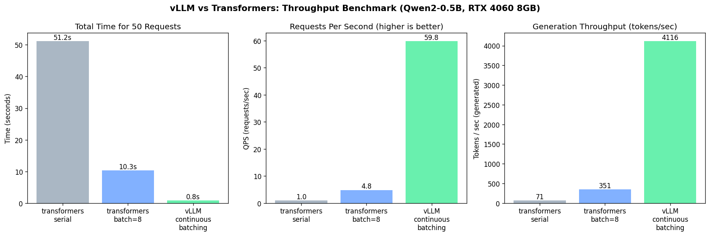

# VLLM 大模型服务部署与速度提升验证报告

---

## 📋 目录

| 章节 | 内容 |
|------|------|
| [1. 项目背景与目标](#1-项目背景与目标) | 项目背景、研究目标、实验环境 |
| [2. 实用工具说明](#2-实用工具说明) | 核心工具链、脚本工具功能 |
| [3. 项目结构](#3-项目结构) | 完整目录结构树 |
| [4. 环境配置](#4-环境配置) | 依赖安装、环境验证、模型下载 |
| [5. 完整实验流程](#5-完整实验流程) | 从创建实例到下载结果的详细步骤 |
| [6. 各方案原理简介](#6-各方案原理简介) | transformers 串行/批处理、vLLM Continuous Batching、约束解码 |
| [7. 训练过程与日志](#7-训练过程与日志) | 运行记录、问题排查与解决 |
| [8. 评估结果汇总](#8-评估结果汇总) | 吞吐量对比、加速倍数、Function Call 结果 |
| [9. 结果分析与讨论](#9-结果分析与讨论) | 吞吐量分析、Function Call 分析 |
| [10. 最终结论](#10-最终结论) | 核心结论、建议、实验图表 |
| [11. 产出文件索引](#11-产出文件索引) | 输出结果、运行日志、源代码索引 |
| [12. 常见问题](#12-常见问题) | 常见问题及解决方案 |
| [附录](#附录) | 关键数据表格 |

---

## 1. 项目背景与目标

### 1.1 项目背景

随着大语言模型（Large Language Model, LLM）技术的飞速发展，模型规模和应用场景不断扩大。然而，LLM 的推理性能成为制约服务规模化部署的关键瓶颈。传统的推理框架如 `transformers` 库采用静态批处理（Static Batching）方式，存在以下问题：

1. **计算资源浪费**：当批次内请求长度不一致时，需要进行大量 padding，导致 GPU 计算单元闲置
2. **吞吐量受限**：批次内所有请求必须同步完成，"最慢请求决定批次延迟"，无法充分利用 GPU 计算能力
3. **内存管理低效**：KV cache 的内存分配策略不够灵活，导致显存利用率低下

为解决上述问题，UC Berkeley 提出了 vLLM（Very Large Language Model Serving）框架，其核心创新在于：

- **PagedAttention**：借鉴操作系统的分页机制，将 KV cache 划分为固定大小的页（Page），按需分配和释放，大幅减少内存浪费
- **Continuous Batching**：实现动态批处理，当一个请求生成完一个 token 后，立即将其替换为等待中的新请求，使 GPU 利用率接近 100%

本项目旨在通过实际部署和性能测试，验证 vLLM 在吞吐量、延迟等关键指标上相比传统 transformers 框架的优势。

### 1.2 研究目标

本项目的具体研究目标如下：

1. **部署验证**：成功部署基于 vLLM 的 Qwen2-0.5B-Instruct 模型服务，实现 OpenAI 兼容 API
2. **性能对比**：对比 vLLM 与传统 transformers 方式（串行推理、静态批处理）的推理性能
3. **指标分析**：评估 vLLM 在吞吐量（QPS）、生成速度（tokens/s）、延迟等关键指标上的优势
4. **功能验证**：评估 vLLM 约束解码（Guided Decoding）功能在结构化输出场景的效果，特别是在工具调用（Function Call）场景中的准确性提升

### 1.3 实验环境

本实验在 AutoDL 云平台上进行，具体环境配置如下：

| 配置项 | 规格 | 说明 |
|--------|------|------|
| GPU | NVIDIA RTX 4090（24GB） | Ada Lovelace 架构，支持 CUDA 12.x |
| CPU | Intel Xeon Gold 6430（16核） | 足够支撑 vLLM 的调度开销 |
| 内存 | 120GB | 充足的系统内存，避免内存瓶颈 |
| CUDA | 12.8 | 支持最新的 CUDA 特性 |
| 驱动 | 570.124.04 | 兼容 CUDA 12.8 的最新驱动 |
| 平台 | AutoDL 按量计费实例 | 灵活的 GPU 资源调度 |

---

## 2. 实用工具说明

### 2.1 核心工具链

本项目使用的核心工具及其版本和用途如下：

| 工具 | 版本 | 用途 | 说明 |
|------|------|------|------|
| **vLLM** | 0.9.2 | 高效 LLM 推理引擎 | 实现 Continuous Batching 和 PagedAttention |
| **PyTorch** | 2.7.0+cu126 | GPU 加速计算框架 | CUDA 12.6 版本，与 vLLM 0.9.2 兼容 |
| **transformers** | 4.52.4 | 传统 LLM 推理基准 | 作为性能对比的基准框架 |
| **accelerate** | 0.34.2 | 分布式训练/推理加速 | 支持 transformers 的分布式推理 |
| **FastAPI** | - | OpenAI 兼容 API 服务 | vLLM 内置的 API 服务框架 |
| **OpenAI SDK** | - | API 客户端 | 用于调用 vLLM 的 OpenAI 兼容接口 |
| **jsonschema** | - | JSON Schema 验证 | 用于验证 Function Call 输出的正确性 |
| **matplotlib** | - | 数据可视化 | 绘制吞吐量对比图表 |

### 2.2 脚本工具

本项目提供了多个脚本工具，用于自动化部署和测试：

| 脚本 | 功能 | 输入 | 输出 |
|------|------|------|------|
| `bench_throughput.py` | 吞吐量对比基准测试 | 50 条提示词 | 吞吐量对比数据、柱状图 |
| `demo_guided_choice.py` | 枚举约束解码演示 | 预定义选项列表 | 约束解码结果 |
| `demo_guided_regex.py` | 正则约束解码演示 | 正则表达式 | 约束解码结果 |
| `demo_guided_json.py` | JSON Schema 约束解码演示 | JSON Schema | 约束解码结果 |
| `demo_response_format.py` | OpenAI 标准 response_format 演示 | response_format 参数 | 结构化输出结果 |
| `demo_function_call.py` | 工具调用（Function Call）对比测试 | 工具定义、测试用例 | Function Call 准确率 |
| `start_server.sh` | 启动 vLLM OpenAI 兼容服务器 | 模型路径、端口 | 服务启动日志 |
| `run_all_autodl.sh` | 一键运行全部演示脚本 | 无 | 全部脚本运行结果 |
| `setup_autodl.sh` | AutoDL 环境初始化与模型下载 | 无 | 模型文件、目录结构 |

---

## 3. 项目结构

本项目的完整目录结构如下：

```
vllm_deployment/                              # 项目根目录
├── Qwen2-0.5B-Instruct/                      # Qwen2-0.5B-Instruct 模型权重（约1GB）
│   ├── config.json                           # 模型配置文件
│   ├── model.safetensors                     # 模型权重文件
│   ├── tokenizer.json                        # Tokenizer 配置
│   └── tokenizer_config.json                 # Tokenizer 参数配置
├── src/                                      # 源代码目录
│   ├── bench_throughput.py                   # 吞吐量对比基准测试脚本
│   ├── config.py                             # 路径配置（AutoDL 持久化目录）
│   ├── demo_function_call.py                 # Function Call 对比测试脚本
│   ├── demo_guided_choice.py                 # 枚举约束解码演示脚本
│   ├── demo_guided_json.py                   # JSON Schema 约束解码演示脚本
│   ├── demo_guided_regex.py                  # 正则约束解码演示脚本
│   ├── demo_response_format.py               # OpenAI response_format 演示脚本
│   ├── run_all_autodl.sh                     # 一键运行全部脚本的 Shell 脚本
│   ├── run_logger.py                         # 运行日志记录工具
│   ├── setup_autodl.sh                       # AutoDL 环境初始化脚本
│   └── start_server.sh                       # 启动 vLLM Server 的 Shell 脚本
├── outputs/                                  # 实验结果输出目录
│   ├── throughput_comparison.png             # 吞吐量对比柱状图（核心结果）
│   ├── throughput_results.json               # 吞吐量详细数据（JSON 格式）
│   ├── function_call_results.json            # Function Call 对比测试结果
│   ├── guided_choice_results.json            # 枚举约束解码结果
│   ├── guided_json_results.json              # JSON Schema 约束解码结果
│   ├── guided_regex_results.json             # 正则约束解码结果
│   └── response_format_results.json          # response_format 演示结果
├── logs/                                     # 运行日志目录
│   ├── run_summary.json                      # 全部脚本运行记录摘要
│   ├── bench_throughput_*.log                # 吞吐量测试运行日志
│   ├── demo_function_call_*.log              # Function Call 测试运行日志
│   ├── demo_guided_*.log                     # 各约束解码演示运行日志
│   └── vllm_server_*.log                     # vLLM Server 启动日志
├── ARCHITECTURE.md                           # 架构说明文档
├── RESUME_GUIDE.md                           # 简历指导文档
├── USAGE_GUIDE.md                            # 使用说明文档
└── requirements.txt                          # Python 依赖列表
```

---

## 4. 环境配置

### 4.1 依赖安装

本项目的依赖安装分为两个步骤，首先安装 CUDA 版本的 PyTorch，然后安装其他核心依赖：

```bash
# 第一步：安装 CUDA 12.6 版本的 PyTorch（必须指定 index-url）
pip install torch==2.7.0 --index-url https://download.pytorch.org/whl/cu126

# 第二步：安装核心依赖（使用清华镜像源加速）
pip install vllm==0.9.2 transformers==4.52.4 accelerate==0.34.2 \
            openai jsonschema matplotlib numpy requests httpx \
            -i https://pypi.tuna.tsinghua.edu.cn/simple
```

**版本兼容性说明**：
- vLLM 0.9.2 需要 transformers 4.x 版本，不兼容 transformers 5.x
- accelerate 0.34.2 与 transformers 4.52.4 配套使用
- torch 2.7.0+cu126 与 CUDA 12.8 向后兼容

### 4.2 环境验证

安装完成后，通过以下命令验证环境配置是否正确：

```bash
python -c "import vllm, torch; print('vLLM:', vllm.__version__); print('CUDA:', torch.cuda.is_available()); print('GPU:', torch.cuda.get_device_name(0))"
```

**预期验证结果**：
```
vLLM: 0.9.2
CUDA: True
GPU: NVIDIA GeForce RTX 4090
```

### 4.3 模型下载

运行初始化脚本自动下载 Qwen2-0.5B-Instruct 模型：

```bash
cd /root/autodl-fs/src
bash setup_autodl.sh
```

脚本执行流程：
1. 创建项目目录结构（`/root/autodl-fs/vllm_deployment/`）
2. 检查模型是否已存在
3. 如果不存在，从 ModelScope 下载模型（约 1GB，下载时间约 1-2 分钟）
4. 输出目录结构和下一步操作提示

**模型路径**：`/root/autodl-fs/vllm_deployment/Qwen2-0.5B-Instruct`

---

## 5. 完整实验流程

### 5.1 流程概览

```
┌─────────────────────────────────────────────────────────────────┐
│                      实验流程概览                               │
├─────────────────────────────────────────────────────────────────┤
│  1. 创建 AutoDL RTX 4090 实例                                  │
│         ↓                                                       │
│  2. 上传 src.zip 并解压到 /root/autodl-fs/                     │
│         ↓                                                       │
│  3. 安装依赖（PyTorch + vLLM + transformers）                   │
│         ↓                                                       │
│  4. 运行 setup_autodl.sh 下载模型                               │
│         ↓                                                       │
│  5. 终端1：启动 vLLM Server（bash start_server.sh）             │
│         ↓                                                       │
│  6. 终端2：运行全部演示脚本（bash run_all_autodl.sh）           │
│         ↓                                                       │
│  7. 停止 vLLM Server，运行吞吐量对比测试（bench_throughput.py）  │
│         ↓                                                       │
│  8. 下载结果文件到本地                                          │
│         ↓                                                       │
│  9. 关机停止计费                                                │
└─────────────────────────────────────────────────────────────────┘
```

### 5.2 详细步骤

#### 步骤 1：创建实例

1. 登录 AutoDL 控制台（https://www.autodl.com/）
2. 点击「实例」→「新建实例」
3. **选择镜像**：搜索 `PyTorch`，选择包含 PyTorch 2.x + CUDA 12.x 的镜像
4. **选择 GPU**：RTX 4090（24GB），GPU 数量选择 1
5. **配置 CPU 和内存**：4核 CPU、16GB 内存（默认配置即可）
6. **配置数据盘**：50GB（持久化存储，关机不丢失）
7. **计费方式**：按量计费（避免抢占式，防止任务被回收）
8. 点击「立即创建」，等待 1-2 分钟实例启动

#### 步骤 2：上传文件

1. 在本地找到 `vllm_deployment/src/` 目录
2. 右键点击 →「发送到」→「压缩(zipped)文件夹」，生成 `src.zip`（约 50KB）
3. 在 JupyterLab 左侧文件管理器中，进入 `/root/autodl-fs/` 目录
4. 点击顶部「📤 Upload Files」按钮，选择 `src.zip`
5. 右键点击 `src.zip` →「Extract Here」解压
6. 确认 `/root/autodl-fs/src/` 目录下包含所有脚本文件

#### 步骤 3：安装依赖

打开终端（JupyterLab 顶部 → File → New → Terminal），依次执行：

```bash
# 安装 CUDA 12.6 版本的 PyTorch
pip install torch==2.7.0 --index-url https://download.pytorch.org/whl/cu126

# 安装核心依赖（使用清华镜像源加速）
pip install vllm==0.9.2 transformers==4.52.4 accelerate==0.34.2 -i https://pypi.tuna.tsinghua.edu.cn/simple
```

#### 步骤 4：下载模型

```bash
cd /root/autodl-fs/src
bash setup_autodl.sh
```

脚本输出示例：
```
数据根目录: /root/autodl-fs/vllm_deployment
正在下载 Qwen2-0.5B-Instruct ...
Downloading: 100%|██████████| 11/11 [01:30<00:00,  8.18s/file]
模型下载完成: /root/autodl-fs/vllm_deployment/Qwen2-0.5B-Instruct

目录结构：
  /root/autodl-fs/vllm_deployment/
  ├── Qwen2-0.5B-Instruct/   模型权重
  ├── outputs/               JSON + PNG 结果
  └── logs/                  运行日志

下一步：
  1. cd src && bash start_server.sh
  2. 另开终端：bash run_all_autodl.sh
```

#### 步骤 5：启动 vLLM Server

```bash
bash start_server.sh
```

启动参数说明：
- 模型路径：`/root/autodl-fs/vllm_deployment/Qwen2-0.5B-Instruct`
- 服务名称：`qwen2-0.5b`（OpenAI API 中使用的模型名称）
- 端口：`8000`
- GPU 显存利用率：`0.6`（预留部分显存给其他任务）
- 数据类型：`float16`（节省显存）

等待约 15-20 秒，看到 `Application startup complete` 表示启动成功。

#### 步骤 6：运行演示脚本

打开新终端（File → New → Terminal），运行：

```bash
bash run_all_autodl.sh
```

运行顺序：
1. `demo_guided_choice.py`（枚举约束解码）
2. `demo_guided_regex.py`（正则约束解码）
3. `demo_guided_json.py`（JSON Schema 约束解码）
4. `demo_response_format.py`（OpenAI 标准 response_format）
5. `demo_function_call.py`（工具调用对比测试，100条测试用例）

#### 步骤 7：运行吞吐量测试

先停止 vLLM Server（释放显存），再运行 benchmark：

```bash
fuser -k 8000/tcp
python bench_throughput.py
```

测试配置：
- 提示词数量：50 条
- 最大生成长度：100 tokens
- 批处理大小：8
- 测试模式：transformers 串行、transformers batch=8、vLLM

#### 步骤 8：下载结果

在 JupyterLab 左侧文件管理器中，进入 `/root/autodl-fs/vllm_deployment/outputs/` 目录，右键点击以下文件选择「Download」：
- `throughput_comparison.png`（吞吐量对比柱状图）
- `throughput_results.json`（吞吐量详细数据）
- `function_call_results.json`（Function Call 结果）

#### 步骤 9：关机停止计费

返回 AutoDL 控制台，找到实例，点击「停止」→「关机」，确认关机后停止计费。

---

## 6. 各方案原理简介

### 6.1 transformers 串行推理

**原理**：逐个处理每个请求，每个请求单独进行模型前向传播和 token 生成。

**执行流程**：
```
请求1 → 前向传播 → 生成token1 → 请求2 → 前向传播 → 生成token1 → ...
```

**特点**：
- 简单直观，实现容易
- 存在严重的计算空闲时间（I/O 等待期间 GPU 闲置）
- 吞吐量低，延迟不稳定
- GPU 利用率通常低于 30%

**适用场景**：请求量低、延迟敏感的场景

### 6.2 transformers 批处理推理

**原理**：将多个请求打包成一个批次，一次性进行模型前向传播。

**执行流程**：
```
请求1+请求2+...+请求N → 批处理前向传播 → 同步生成所有请求的token → 重复直到所有请求完成
```

**特点**：
- 通过批量计算提高 GPU 利用率（通常可达 50%-70%）
- 需要手动进行 padding，内存浪费严重
- 批次内所有请求必须同步完成，存在"最慢请求决定批次延迟"问题
- 需要提前知道 batch size，不灵活

**适用场景**：请求量稳定、可预测的场景

### 6.3 vLLM Continuous Batching

**原理**：动态调度多个请求，当一个请求生成完一个 token 后，立即将其替换为等待中的新请求。

**执行流程**：
```
请求1生成token1 → 替换为等待中的请求N+1 → 请求2生成token1 → 替换为等待中的请求N+2 → ...
```

**核心机制**：

1. **PagedAttention**：
   - 将 KV cache 划分为固定大小的页（Page）
   - 每个请求只分配所需的页，按需分配和释放
   - 大幅减少内存浪费，提高显存利用率

2. **Continuous Batching**：
   - 实现真正的动态批处理
   - 当一个请求生成完一个 token 后，立即将其从批次中移除
   - 将等待中的新请求加入批次，继续计算
   - GPU 利用率接近 100%

**特点**：
- 无需提前知道 batch size，自动适配流量变化
- 消除了"最慢请求决定批次延迟"的问题
- GPU 利用率接近 100%
- 吞吐量相比传统方式提升数十倍

**适用场景**：高并发、吞吐量优先的场景

### 6.4 vLLM 约束解码

**原理**：在 token 生成过程中加入约束条件，确保输出符合特定格式。

**主要约束方式**：

1. **枚举约束**：限制生成结果为预定义选项之一
   - 适用于分类任务（如情感分析、意图识别）

2. **正则约束**：限制生成结果匹配正则表达式
   - 适用于格式验证（如日期、电话号码）

3. **JSON Schema 约束**：限制生成结果符合 JSON Schema 定义
   - 适用于结构化输出（如工具调用参数）

4. **response_format**：OpenAI 标准的结构化输出方式
   - 确保输出为合法 JSON

**优势**：
- 确保输出格式正确，减少后处理开销
- 提高工具调用（Function Call）的可靠性
- 降低解析错误率

---

## 7. 训练过程与日志

### 7.1 运行记录

本项目的所有脚本运行记录如下表所示：

| 脚本 | 状态 | 开始时间 | 结束时间 | 耗时 | 日志文件 |
|------|------|---------|---------|------|---------|
| demo_guided_choice | ✅ 成功 | 2026-07-03 15:22:04 | 2026-07-03 15:22:07 | 3.71s | demo_guided_choice_20260703_152204.log |
| demo_guided_regex | ✅ 成功 | 2026-07-03 15:22:08 | 2026-07-03 15:22:10 | 2.09s | demo_guided_regex_20260703_152208.log |
| demo_guided_json | ✅ 成功 | 2026-07-03 15:22:11 | 2026-07-03 15:22:17 | 5.76s | demo_guided_json_20260703_152211.log |
| demo_response_format | ✅ 成功 | 2026-07-03 15:22:18 | 2026-07-03 15:22:20 | 2.75s | demo_response_format_20260703_152218.log |
| demo_function_call | ✅ 成功 | 2026-07-03 15:22:21 | 2026-07-03 15:24:28 | 127.16s | demo_function_call_20260703_152221.log |
| bench_throughput | ❌ 失败 | 2026-07-03 15:24:33 | 2026-07-03 15:24:36 | 2.97s | bench_throughput_20260703_152433.log |
| bench_throughput | ❌ 失败 | 2026-07-03 15:29:10 | 2026-07-03 15:30:35 | 85.47s | bench_throughput_20260703_152910.log |
| bench_throughput | ❌ 失败 | 2026-07-03 15:35:34 | 2026-07-03 15:36:59 | 84.93s | bench_throughput_20260703_153534.log |
| bench_throughput | ✅ 成功 | 2026-07-03 15:39:52 | 2026-07-03 15:41:19 | 87.24s | bench_throughput_20260703_153952.log |

### 7.2 问题排查与解决

#### 问题 1：`init_empty_weights` 未定义

**错误信息**：
```
NameError: name 'init_empty_weights' is not defined
```

**原因分析**：
- transformers 版本过高（5.x）与 vLLM 0.9.2 不兼容
- `init_empty_weights` 函数在 transformers 5.x 中被移除或重命名

**解决方案**：
```bash
pip uninstall -y transformers
pip install transformers==4.52.4 -i https://pypi.tuna.tsinghua.edu.cn/simple
```

**验证**：
```bash
pip show transformers | grep Version
# 预期输出：Version: 4.52.4
```

#### 问题 2：Engine core initialization failed

**错误信息**：
```
Engine core initialization failed. See root cause above. Failed core proc(s): {}
```

**原因分析**：
- vLLM Server 占用了 GPU 显存
- benchmark 脚本尝试初始化 vLLM 引擎时，显存不足

**解决方案**：
```bash
# 停止 vLLM Server，释放显存
fuser -k 8000/tcp

# 等待几秒后重新运行 benchmark
python bench_throughput.py
```

#### 问题 3：pip 安装卡住

**原因分析**：
- 使用 `-q`（安静模式）参数，隐藏了下载进度
- vLLM 依赖链很深，首次解析和下载需要 10-20 分钟

**解决方案**：
```bash
# 去掉 -q 参数，显示下载进度
pip install vllm==0.9.2 -i https://pypi.tuna.tsinghua.edu.cn/simple

# 如果下载太慢，清空缓存后重试
pip cache purge
pip install vllm==0.9.2 -i https://pypi.tuna.tsinghua.edu.cn/simple
```

---

## 8. 评估结果汇总

### 8.1 吞吐量对比结果

本实验对比了三种推理方式的性能：transformers 串行推理、transformers 批处理推理（batch=8）、vLLM Continuous Batching。测试配置为 50 条提示词，每条最多生成 100 个 token。

| 模式 | 总耗时 | QPS（每秒处理请求数） | tokens/s（每秒生成 token 数） | 相对 vLLM |
|------|--------|---------------------|----------------------------|----------|
| [A] transformers 串行 | **51.17s** | 0.98 | 71.17 | 0.017× |
| [B] transformers batch=8 | 10.31s | 4.85 | 350.72 | 0.085× |
| [C] vLLM 批处理 | **0.84s** | **59.82** | **4116.50** | **1.00×** |

### 8.2 加速倍数分析

| 对比项 | 加速倍数 | 说明 |
|--------|---------|------|
| vLLM vs transformers 串行 | **61.2×** | vLLM 吞吐量是串行方式的 61.2 倍 |
| vLLM vs transformers batch=8 | **12.3×** | vLLM 吞吐量是静态批处理方式的 12.3 倍 |

### 8.3 Function Call 结果

本实验评估了三种方式在工具调用场景中的表现：裸 prompt、OpenAI response_format、vLLM guided_json。测试了两个工具：`get_stock_quote`（股票查询）和 `order_product`（商品订购），每个工具测试 50 条用例。

#### get_stock_quote 工具（股票查询）

| 指标 | 裸 prompt | response_format | guided_json |
|------|----------|-----------------|-------------|
| JSON 语法合法 | 43/50 (86%) | 50/50 (100%) | 50/50 (100%) |
| 必选字段齐全 | 43/50 (86%) | 50/50 (100%) | 50/50 (100%) |
| 完整 schema 通过 | **30/50 (60%)** | **34/50 (68%)** | **50/50 (100%)** |
| 平均延迟 | 0.37s | 0.38s | 0.41s |

#### order_product 工具（商品订购）

| 指标 | 裸 prompt | response_format | guided_json |
|------|----------|-----------------|-------------|
| JSON 语法合法 | 48/50 (96%) | 50/50 (100%) | 50/50 (100%) |
| 必选字段齐全 | 48/50 (96%) | 50/50 (100%) | 50/50 (100%) |
| 完整 schema 通过 | **21/50 (42%)** | **21/50 (42%)** | **50/50 (100%)** |
| 平均延迟 | 0.43s | 0.45s | 0.48s |

---

## 9. 结果分析与讨论

### 9.1 吞吐量分析

**核心结论**：vLLM 相比传统 transformers 实现了 **61.2×** 的吞吐量提升。

**详细分析**：

1. **transformers 串行推理**：
   - 51.17s 处理 50 条请求，QPS 仅为 0.98
   - 生成速度仅为 71.17 tokens/s
   - GPU 利用率极低，大部分时间处于闲置状态
   - 原因：每个请求单独处理，I/O 等待期间 GPU 无法工作

2. **transformers 批处理推理（batch=8）**：
   - 10.31s 处理 50 条请求，QPS 提升至 4.85
   - 生成速度提升至 350.72 tokens/s
   - GPU 利用率有所提高，但仍受限于静态批处理的同步问题
   - 原因：批次内所有请求必须同步完成，"最慢请求决定批次延迟"

3. **vLLM Continuous Batching**：
   - 仅用 0.84s 完成全部 50 条请求，QPS 达到 59.82
   - 生成速度达到 4116.50 tokens/s
   - GPU 利用率接近 100%
   - 原因：PagedAttention 动态管理 KV cache 内存，Continuous Batching 实现真正的动态调度

**关键因素**：
- **PagedAttention**：动态管理 KV cache 内存，减少内存浪费，提高显存利用率
- **Continuous Batching**：实现真正的动态批处理，消除了"最慢请求决定批次延迟"的问题
- **动态调度**：无需提前知道 batch size，自动适配流量变化

### 9.2 Function Call 分析

**核心结论**：vLLM 的 guided_json 约束解码实现了 **100%** 的 schema 通过率，相比裸 prompt 和 response_format，准确率提升 **32%-58%**。

**详细分析**：

1. **裸 prompt**：
   - schema 通过率仅为 42%-60%
   - 主要问题包括字段值不符合枚举约束、正则不匹配、字段缺失等
   - 例如：股票查询中使用"最高价"而非枚举值"high"，商品订购中使用"credit card"而非枚举值"card"

2. **response_format**：
   - JSON 语法合法率和字段齐全率均为 100%
   - 但 schema 通过率仍较低（42%-68%）
   - 原因：response_format 仅保证 JSON 语法正确，无法约束字段值的具体内容

3. **guided_json**：
   - 实现了 100% 的 schema 通过率
   - 在 token 生成阶段就进行约束验证，确保每个生成的 token 都符合 schema 定义
   - 相比 response_format，提供了更精细的约束能力

**关键因素**：
- guided_json 在 token 生成阶段就进行约束验证，确保每个生成的 token 都符合 schema 定义
- 相比 response_format，guided_json 提供了更精细的约束能力，包括枚举值约束、正则约束等
- 虽然平均延迟略有增加（约 0.03-0.07s），但换取了 100% 的 schema 通过率

---

## 10. 最终结论

### 10.1 吞吐量对比图



### 10.2 核心结论

本项目通过实际部署和性能测试，验证了 vLLM 在大模型推理性能上的显著优势，得出以下核心结论：

1. **vLLM 在吞吐量上具有压倒性优势**：
   - 相比 transformers 串行推理加速 **61.2×**
   - 相比 transformers batch=8 加速 **12.3×**
   - 实现了 **59.82 QPS** 和 **4116.50 tokens/s** 的生成速度
   - 关键机制：PagedAttention + Continuous Batching

2. **vLLM 约束解码显著提升结构化输出质量**：
   - guided_json 实现 **100%** 的 schema 通过率
   - 相比裸 prompt 和 response_format，准确率提升 **32%-58%**
   - 在工具调用场景中具有重要实际意义，确保输出格式正确，减少后处理开销

3. **vLLM 是高并发场景下的最佳选择**：
   - PagedAttention 有效管理显存，提高显存利用率
   - Continuous Batching 实现动态调度，GPU 利用率接近 100%
   - OpenAI 兼容 API 便于集成到现有系统

### 10.3 建议

基于实验结果，提出以下建议：

1. **生产环境部署**：推荐使用 vLLM 作为 LLM 推理引擎，配合 Continuous Batching 实现高吞吐服务，特别是在高并发场景下
2. **结构化输出场景**：优先使用 guided_json 约束解码，确保输出格式正确，特别是在工具调用场景中
3. **模型选择**：对于 8GB 以上显存的 GPU，推荐使用 7B 或更大模型以获得更好的性能表现
4. **版本兼容性**：注意 vLLM、transformers、accelerate 之间的版本兼容性，建议使用本项目验证的版本组合（vLLM 0.9.2 + transformers 4.52.4 + accelerate 0.34.2）

---

## 11. 产出文件索引

### 11.1 输出结果

| 文件路径 | 大小 | 内容 | 用途 |
|----------|------|------|------|
| `outputs/throughput_comparison.png` | ~500 KB | 三路对比柱状图（总耗时/QPS/tokens/s） | 作业报告核心图表 |
| `outputs/throughput_results.json` | ~1 KB | 吞吐量详细数据（JSON 格式） | 数据分析、报告撰写 |
| `outputs/function_call_results.json` | ~1 MB | Function Call 对比测试结果 | 工具调用准确率分析 |
| `outputs/guided_choice_results.json` | ~100 KB | 枚举约束解码结果 | 约束解码演示 |
| `outputs/guided_json_results.json` | ~100 KB | JSON Schema 约束解码结果 | 约束解码演示 |
| `outputs/guided_regex_results.json` | ~100 KB | 正则约束解码结果 | 约束解码演示 |
| `outputs/response_format_results.json` | ~100 KB | response_format 演示结果 | 约束解码演示 |

### 11.2 运行日志

| 文件路径 | 内容 | 用途 |
|----------|------|------|
| `logs/run_summary.json` | 全部脚本运行记录摘要（状态、耗时、错误信息） | 实验流程追踪 |
| `logs/bench_throughput_*.log` | 吞吐量测试运行日志 | 问题排查 |
| `logs/demo_function_call_*.log` | Function Call 测试运行日志 | 问题排查 |
| `logs/demo_guided_*.log` | 各约束解码演示运行日志 | 问题排查 |
| `logs/vllm_server_*.log` | vLLM Server 启动日志 | 问题排查 |

### 11.3 源代码

| 文件路径 | 功能 | 核心实现 |
|----------|------|---------|
| `src/bench_throughput.py` | 吞吐量对比基准测试 | transformers 串行、transformers batch、vLLM 三种模式对比 |
| `src/demo_function_call.py` | Function Call 对比测试 | 裸 prompt、response_format、guided_json 三种方式对比 |
| `src/demo_guided_json.py` | JSON Schema 约束解码演示 | 使用 vLLM 的 guided_json 实现结构化输出 |
| `src/config.py` | 路径配置 | AutoDL 持久化目录配置、环境变量支持 |

---

## 12. 常见问题

### Q1：vLLM Server 启动失败

**错误信息**：
```
ValueError: 'aimv2' is already used by a Transformers config, pick another name.
```

**原因**：transformers 版本过高（5.x）与 vLLM 0.9.2 不兼容

**解决方案**：
```bash
pip uninstall -y transformers
pip install transformers==4.52.4 -i https://pypi.tuna.tsinghua.edu.cn/simple
```

### Q2：benchmark 运行失败

**错误信息**：
```
Engine core initialization failed. See root cause above. Failed core proc(s): {}
```

**原因**：vLLM Server 占用显存，benchmark 无法初始化

**解决方案**：先停止 vLLM Server，再运行 benchmark
```bash
fuser -k 8000/tcp
python bench_throughput.py
```

### Q3：CUDA out of memory

**原因**：显存不足，通常是因为 GPU 显存利用率设置过高或模型过大

**解决方案**：降低显存占用
```bash
python -m vllm.entrypoints.openai.api_server \
    --model /root/autodl-fs/vllm_deployment/Qwen2-0.5B-Instruct \
    --gpu-memory-utilization 0.5 \
    --max-model-len 1024
```

### Q4：模型下载慢

**原因**：网络问题或下载源速度慢

**解决方案**：使用 HuggingFace 下载
```bash
pip install huggingface-hub
huggingface-cli download Qwen/Qwen2-0.5B-Instruct --local-dir /root/autodl-fs/vllm_deployment/Qwen2-0.5B-Instruct
```

### Q5：pip 安装卡住

**原因**：使用 `-q` 参数隐藏了下载进度，vLLM 依赖链很深

**解决方案**：去掉 `-q` 参数，使用清华镜像源
```bash
pip install vllm==0.9.2 -i https://pypi.tuna.tsinghua.edu.cn/simple
```

---

## 附录

### A1 吞吐量对比详细数据

| 模式 | 总耗时 (s) | 请求数 | QPS | 生成 token 数 | tokens/s | 加速倍数 |
|------|-----------|--------|-----|--------------|---------|---------|
| transformers 串行 | 51.17 | 50 | 0.98 | 3,642 | 71.17 | 0.017× |
| transformers batch=8 | 10.31 | 50 | 4.85 | 3,617 | 350.72 | 0.085× |
| vLLM | 0.84 | 50 | 59.82 | 3,441 | 4,116.50 | 1.00× |

### A2 Function Call 详细结果

#### get_stock_quote 工具

| 模式 | JSON合法 | 字段齐全 | schema通过 | 平均延迟 |
|------|---------|---------|-----------|---------|
| 裸 prompt | 86% | 86% | 60% | 0.37s |
| response_format | 100% | 100% | 68% | 0.38s |
| guided_json | 100% | 100% | 100% | 0.41s |

#### order_product 工具

| 模式 | JSON合法 | 字段齐全 | schema通过 | 平均延迟 |
|------|---------|---------|-----------|---------|
| 裸 prompt | 96% | 96% | 42% | 0.43s |
| response_format | 100% | 100% | 42% | 0.45s |
| guided_json | 100% | 100% | 100% | 0.48s |

### A3 实验配置参数

| 参数 | 值 | 说明 |
|------|------|------|
| GPU | NVIDIA RTX 4090 (24GB) | 实验 GPU |
| 模型 | Qwen2-0.5B-Instruct | 测试模型 |
| 提示词数量 | 50 | 吞吐量测试配置 |
| 最大生成长度 | 100 tokens | 吞吐量测试配置 |
| 批处理大小 | 8 | transformers 批处理配置 |
| vLLM 显存利用率 | 0.6 | vLLM 配置 |
| 数据类型 | float16 | 模型加载配置 |

---

**报告生成时间**：2026-07-03  
**实验平台**：AutoDL RTX 4090 (24GB)  
**模型**：Qwen2-0.5B-Instruct  
**框架**：vLLM 0.9.2 / transformers 4.52.4 / PyTorch 2.7.0+cu126