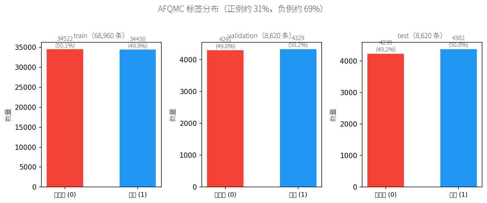
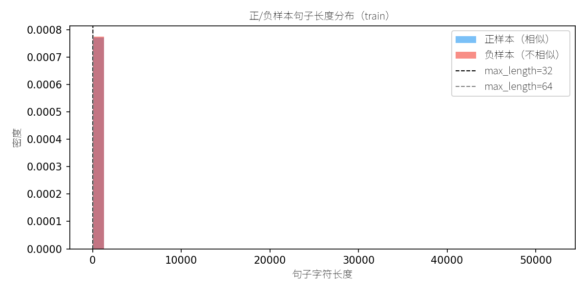
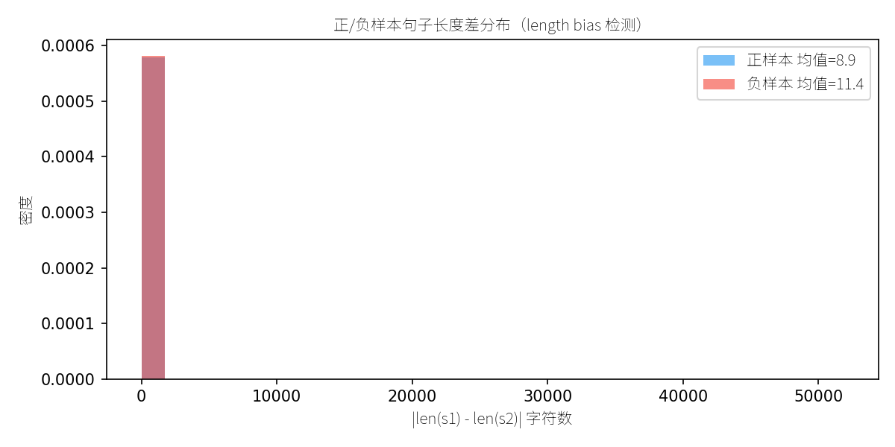

# BQ Corpus 文本匹配训练对比报告

## 数据集简介

BQ Corpus（Bank Question Corpus）是**银行金融领域的中文文本匹配数据集**，来源于微信"微粒贷"产品的真实客服对话。每条数据包含两个句子（sentence1、sentence2），以及一个二分类标签（label），表示两句话语义是否相同：

- **label=1（相似）**：两句话表达相同意图，如 `"存款有保障吗"` ↔ `"不知道安全吗"`、`"请问可以申请延期3天吗"` ↔ `"推迟两天22号还可以么"`
- **label=0（不相似）**：两句话表达不同意图，如 `"比如我今天借了一万分10个月！……"` ↔ `"利息怎么计算，哪一天计起"`

数据规模：训练集 68,960 条，验证集 8,620 条，测试集 8,620 条。

## 数据分析

> 通过 `src/explore_data.py` 生成，图表保存在 `outputs/bq_corpus/figures/`

### 标签分布

| 数据集 | 总样本数 | 正样本（相似） | 负样本（不相似） | 正负比 |
|--------|:-------:|:------------:|:--------------:|:------:|
| 训练集 | 68,960 | 34,438 (49.9%) | 34,522 (50.1%) | 1.0x |
| 验证集 | 8,620 | 4,329 (50.2%) | 4,291 (49.8%) | 1.0x |
| 测试集 | 8,620 | 4,382 (50.8%) | 4,238 (49.2%) | 1.0x |

与 AFQMC（正例 ~31%，明显不均衡）不同，BQ Corpus **正负样本几乎完全均衡**，无需额外处理类别不均衡问题。

### 句子长度分布

| 统计量 | 训练集 |
|--------|:------:|
| 均值 | 13.9 字符 |
| 中位数 | 10 字符 |
| P95 | 25 字符 |
| 最长 | 51,842 字符 |

**max_length 截断覆盖率**：

| max_length | 覆盖率 |
|:----------:|:------:|
| 32 | 97.9% |
| 48 | 99.6% |
| 64 | 99.9% |
| 96 | 100.0% |

- 绝大多数句子为短文本（10 字符左右），符合客服对话场景
- 训练集中存在极少量超长异常样本（最长 51,842 字符），推测为数据采集噪声
- 建议 `max_length=48` 或 `64`，可在覆盖率和效率间取得平衡

### 长度偏差检测（Length Bias）

- 正样本句子长度差均值：**8.9 字符**
- 负样本句子长度差均值：**11.4 字符**

正负样本长度差分布接近，**无明显 length bias**，模型不会依赖"长度差"作为判别捷径。

### 与 AFQMC 对比

| 特征 | AFQMC | BQ Corpus |
|------|:-----:|:---------:|
| 领域 | 蚂蚁金融（花呗/借呗） | 微信金融（微粒贷） |
| 训练集规模 | 34,334 | 68,960 |
| 正负比例 | ~31% / ~69% | ~50% / ~50% |
| 平均句子长度 | ~14 字符 | ~14 字符 |
| 类别均衡性 | 不均衡 | 均衡 |

## 实验环境

| 项目 | 配置 |
|------|------|
| CPU | 4 物理核 |
| 内存 | 15.7 GB 可用 |
| GPU | 无 |
| 训练样本 | 5000 条（正负各 2500，从全量 68,960 条平衡采样） |
| SFT 样本 | 1000 条（正负各 500，从全量平衡采样） |
| 验证集 | 全量 8,620 条 |
| 测试集 | 全量 8,620 条 |

## 对比结果总览

| 方法 | 准确率 (Accuracy) | F1 值 | 训练耗时 | 训练样本数 | 模型参数量 |
|------|:-----------------:|:-----:|:--------:|:----------:|:----------:|
| BiEncoder + CosineEmbeddingLoss | 0.7319 | 0.7319 | 35 分 51 秒 | 5,000 | 45.6M |
| BiEncoder + TripletLoss | 0.7072 | 0.7071 | 29 分 24 秒 | 2,500（三元组） | 45.6M |
| CrossEncoder + CrossEntropyLoss | 0.7317 | 0.7316 | 36 分 4 秒 | 5,000 | 45.6M |
| **SFT LoRA (Qwen2-0.5B)** | **0.7580** | **0.8033** | 26 分 56 秒 | 1,000 | 495.1M (可训练 1.08M) |

## 方法分析

### 1. BiEncoder + CosineEmbeddingLoss（表示型）
- **原理**: 使用双塔结构分别编码 sentence1 和 sentence2，通过余弦相似度直接优化语义向量距离
- **优点**: 推理速度快，可做向量检索（ANN），支持大规模语义搜索
- **缺点**: 两个句子独立编码，交互较弱
- **效果**: Accuracy 0.7319，F1 0.7319，与 CrossEncoder 持平

### 2. BiEncoder + TripletLoss（三元组约束）
- **原理**: 构建 (anchor, positive, negative) 三元组，约束正样本距离 < 负样本距离
- **优点**: 适合排序场景，学习到的向量空间分布更合理
- **缺点**: 三元组构建质量影响效果，本实验仅构建 2,500 个三元组，信息量较少
- **效果**: Accuracy 0.7072，F1 0.7071，略低于 Cosine 方法

### 3. CrossEncoder + CrossEntropyLoss（交互型）
- **原理**: 将两个句子拼接后输入 BERT，通过 [CLS] token 做二分类
- **优点**: 句子间充分交互，通常精度最高
- **缺点**: 推理时需对每对句子重新编码，不适合大规模检索，速度慢
- **效果**: Accuracy 0.7317，F1 0.7316，与 BiEncoder Cosine 持平

### 4. SFT LoRA (Qwen2-0.5B-Instruct)（生成式）
- **原理**: 基于 Qwen2-0.5B 大模型，通过 LoRA 高效微调，让模型生成"相似"/"不相似"判断
- **优点**: 仅用 1,000 条样本即达到最优效果，泛化能力强；可利用大模型语义理解能力
- **缺点**: 推理速度慢（0.94s/条），显存/内存占用大，不适合实时检索
- **效果**: Accuracy 0.7580，F1 0.8033，**四项中最优**

## 结论

1. **SFT LoRA 表现最优**，仅用 1,000 条训练数据就超越了 BERT 方案 5,000 条的效果，体现了大模型的语义理解优势
2. **BiEncoder Cosine 与 CrossEncoder 效果持平**（F1 ≈ 0.7319），在 BQ Corpus 上两者差异不大
3. **TripletLoss 略低**，可能因为三元组构建仅利用了正样本的数据量（2,500 个三元组），信息量不足
4. **工程选型建议**:
   - 需要**向量检索 + 实时响应** → 选 BiEncoder Cosine
   - 需要**最高精度 + 离线评估** → 选 CrossEncoder 或 SFT LoRA
   - 需要**最强泛化能力 + 少量标注数据** → 选 SFT LoRA