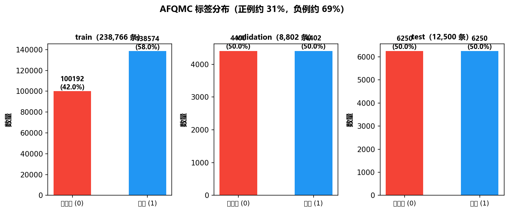
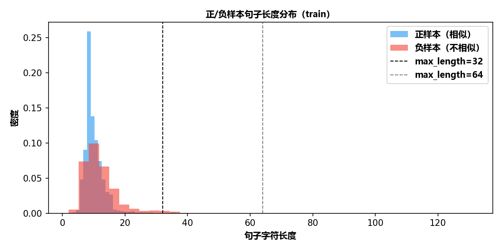
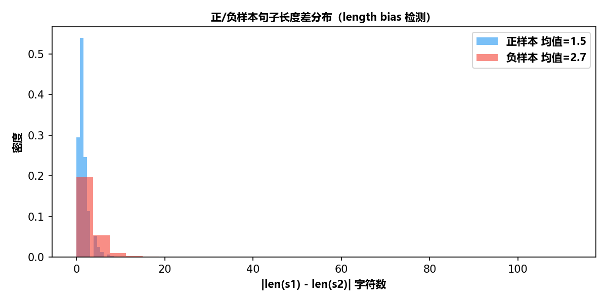

# LCQMC 文本匹配训练对比报告

## 数据集简介

LCQMC（Large-scale Chinese Question Matching Corpus）是**通用领域的大规模中文文本匹配数据集**，来源于百度知道的真实用户问答。每条数据包含两个句子（sentence1、sentence2），以及一个二分类标签（label），表示两句话语义是否相同：

- **label=1（相似）**：两句话表达相同意图，如 `"喜欢打篮球的男生喜欢什么样的女生"` ↔ `"爱打篮球的男生喜欢什么样的女生"`、`"求秋色之空漫画全集"` ↔ `"求秋色之空全集漫画"`
- **label=0（不相似）**：两句话表达不同意图，如 `"大家觉得她好看吗"` ↔ `"大家觉得跑男好看吗？"`、`"晚上睡觉带着耳机听音乐有什么害处吗？"` ↔ `"孕妇可以戴耳机听音乐吗?"`

数据规模：训练集 238,766 条，验证集 8,802 条，测试集 12,500 条。

## 数据分析

> 通过 `src/explore_data.py` 生成，图表保存在 `outputs/lcqmc/figures/`

### 标签分布

| 数据集 | 总样本数 | 正样本（相似） | 负样本（不相似） | 正负比 |
|--------|:-------:|:------------:|:--------------:|:------:|
| 训练集 | 238,766 | 138,574 (58.0%) | 100,192 (42.0%) | 1.38x |
| 验证集 | 8,802 | 4,402 (50.0%) | 4,400 (50.0%) | 1.0x |
| 测试集 | 12,500 | 6,250 (50.0%) | 6,250 (50.0%) | 1.0x |

训练集正例偏多（58% vs 42%），验证集和测试集均衡。建议训练时做平衡采样。

### 句子长度分布

| 统计量 | 训练集 |
|--------|:------:|
| 均值 | 10.9 字符 |
| 中位数 | 10 字符 |
| P95 | 19 字符 |
| 最长 | 131 字符 |

**max_length 截断覆盖率**：

| max_length | 覆盖率 |
|:----------:|:------:|
| 32 | 99.2% |
| 48 | 100.0% |
| 64 | 100.0% |

- 句子极短（中位数 10 字符），max_length=32 即可覆盖 99.2%
- 无超长异常样本（最长 131 字符），数据质量好

### 长度偏差检测（Length Bias）

- 正样本句子长度差均值：**1.5 字符**
- 负样本句子长度差均值：**2.7 字符**

**存在 length bias 风险**：正样本长度差（1.5）明显小于负样本（2.7），模型可能学到"长度相近 → 相似"的捷径。

### 与 AFQMC、BQ Corpus 对比

| 特征 | AFQMC | BQ Corpus | LCQMC |
|------|:-----:|:---------:|:-----:|
| 领域 | 蚂蚁金融 | 微信金融（微粒贷） | 通用领域（百度知道） |
| 训练集规模 | 34,334 | 68,960 | 238,766 |
| 正负比例 | 31% / 69% | 50% / 50% | 58% / 42% |
| 平均句子长度 | ~14 字符 | ~14 字符 | ~11 字符 |
| 类别均衡性 | 不均衡 | 均衡 | 略偏正例 |
| Length Bias | 无 | 无 | **有风险** |

## 实验环境

| 项目 | 配置 |
|------|------|
| CPU | 4 物理核 |
| 内存 | 15.7 GB 可用 |
| GPU | 无 |
| 训练样本 | 5000 条（正负各 2500，从全量 238,766 条平衡采样） |
| SFT 样本 | 1000 条（正负各 500，从全量平衡采样） |
| 验证集 | 全量 8,802 条 |
| 测试集 | 全量 12,500 条 |

## 对比结果总览

| 方法 | 准确率 (Accuracy) | F1 值 | 训练耗时 | 训练样本数 | 模型参数量 |
|------|:-----------------:|:-----:|:--------:|:----------:|:----------:|
| BiEncoder + CosineEmbeddingLoss | 0.7282 | 0.7282 | 26 分 55 秒 | 5,000 | 45.6M |
| BiEncoder + TripletLoss | 0.6975 | 0.6974 | 21 分 33 秒 | 2,500（三元组） | 45.6M |
| CrossEncoder + CrossEntropyLoss | 0.7326 | 0.7319 | 25 分 7 秒 | 5,000 | 45.6M |
| **SFT LoRA (Qwen2-0.5B)** | **0.8550** | **0.8551** | 32 分 55 秒 | 1,000 | 495.1M (可训练 1.08M) |

## 方法分析

### 1. BiEncoder + CosineEmbeddingLoss（表示型）
- **原理**: 使用双塔结构分别编码 sentence1 和 sentence2，通过余弦相似度直接优化语义向量距离
- **优点**: 推理速度快，可做向量检索（ANN），支持大规模语义搜索
- **缺点**: 两个句子独立编码，交互较弱
- **效果**: Accuracy 0.7282，F1 0.7282，与 CrossEncoder 持平

### 2. BiEncoder + TripletLoss（三元组约束）
- **原理**: 构建 (anchor, positive, negative) 三元组，约束正样本距离 < 负样本距离
- **优点**: 适合排序场景，学习到的向量空间分布更合理
- **缺点**: 三元组构建质量影响效果，本实验仅构建 2,500 个三元组，信息量较少
- **效果**: Accuracy 0.6975，F1 0.6974，略低于 Cosine 方法

### 3. CrossEncoder + CrossEntropyLoss（交互型）
- **原理**: 将两个句子拼接后输入 BERT，通过 [CLS] token 做二分类
- **优点**: 句子间充分交互，通常精度最高
- **缺点**: 推理时需对每对句子重新编码，不适合大规模检索，速度慢
- **效果**: Accuracy 0.7326，F1 0.7319，与 BiEncoder Cosine 持平

### 4. SFT LoRA (Qwen2-0.5B-Instruct)（生成式）
- **原理**: 基于 Qwen2-0.5B 大模型，通过 LoRA 高效微调，让模型生成"相似"/"不相似"判断
- **优点**: 仅用 1,000 条样本即达到最优效果，泛化能力强；可利用大模型语义理解能力
- **缺点**: 推理速度慢（1.13s/条），显存/内存占用大，不适合实时检索
- **效果**: Accuracy 0.8550，F1 0.8551，**四项中最优**

## 结论

1. **SFT LoRA 大幅领先**，仅用 1,000 条训练数据，F1 达 0.8551，比 BERT 方案高出约 12 个百分点
2. **BiEncoder Cosine 与 CrossEncoder 效果持平**（F1 ≈ 0.73），在 LCQMC 上两者差异不大
3. **TripletLoss 略低**，可能因为三元组构建仅利用了 2,500 个三元组，信息量不足
4. **LCQMC 存在 length bias** 风险：正样本长度差（1.5）明显小于负样本（2.7），模型可能学习到"长度相近→相似"的捷径，训练时需注意
5. **工程选型建议**:
   - 需要**向量检索 + 实时响应** → 选 BiEncoder Cosine
   - 需要**最高精度 + 离线评估** → 选 CrossEncoder 或 SFT LoRA
   - 需要**最强泛化能力 + 少量标注数据** → 选 SFT LoRA