# 开源大语言模型结构综述报告

> **调查方式**：通过 3 个并行的调研子代理，分头检索**稠密 Transformer、MoE 混合专家、前沿混合架构与最新开源模型**三类话题的官方技术报告、官方模型卡与权威技术博客，再交叉核对整合。
> **范围**：以开源/开放权重模型为主（LLaMA、Qwen、Mistral、Gemma、Phi、Mixtral、DeepSeek、OLMoE、GPT-OSS、Kimi、GLM 等），辅以架构相关的代表性研究（Mamba、RWKV、RetNet 等）。
> **可靠性说明**：2026 年新发布模型（Qwen3.8-Max、Kimi K3、GLM-5.2、Gemma 4、DeepSeek V4 等）多数尚无公开技术报告，文中细节来自官方模型卡/博客与多来源交叉验证；凡未能完全确认的信息均在文中标注"未能完全确认"，引用时请勿作为定论。

---

## 目录

1. [Transformer 基础架构回顾](#一transformer-基础架构回顾)
2. [核心组件技术速览](#二核心组件技术速览)
3. [稠密 Decoder-only Transformer 模型](#三稠密-decoder-only-transformer-模型)
4. [MoE 混合专家架构](#四moe-混合专家架构)
5. [前沿混合架构与新式结构](#五前沿混合架构与新式结构)
6. [2026 年最新开源权重模型](#六2026-年最新开源权重模型)
7. [架构演进趋势总结](#七架构演进趋势总结)
8. [参考资料](#八参考资料)
9. [架构总览：结构全景图](#架构总览结构全景图)

---

## 架构总览：结构全景图

> 下图把全文涉及的开源模型按四条主线归类，作为后续章节的"地图"：① 稠密 Transformer、② MoE 混合专家、③ 混合/新式架构、④ 2026 年旗舰趋势。各模型的详细数字见对应章节。

```mermaid
flowchart TD
    Root["开源大语言模型架构全景"]

    Root --> Dense["① 稠密 Transformer<br/>FFN 全量激活 · 典型规模 1B~72B · 中小规模高效基线"]
    Dense --> D1["LLaMA 1~3.2<br/>GQA · RoPE θ=500k · 128K ctx"]
    Dense --> D2["Qwen2 / 2.5 / 3 稠密<br/>GQA · QK-Norm · 128K ctx"]
    Dense --> D3["Mistral 7B / Small 3<br/>SWA 滑窗 · RoPE θ=1e9"]
    Dense --> D4["Gemma 2 / 3<br/>GeGLU · 局部/全局交替 · 多模态"]
    Dense --> D5["Phi 2~4<br/>partial RoPE · 块稀疏 · 数据驱动"]

    Root --> MoE["② MoE 混合专家<br/>稀疏激活 · 激活参数远小于总参数 · 专家常驻显存"]
    MoE --> M1["Mixtral 8x7B / 8x22B<br/>8 专家 · top-2 · MHA"]
    MoE --> M2["DeepSeek V2 / V3<br/>细粒度专家 + 共享专家 · MLA · top-8"]
    MoE --> M3["Qwen1.5-MoE / Qwen3-MoE<br/>细粒度专家 · upcycling · 128 专家"]
    MoE --> M4["OLMoE<br/>64 专家 · top-8 · 无共享专家"]
    MoE --> M5["GPT-OSS 120B<br/>128 专家 top-4 · 全/滑窗交替 · MXFP4"]

    Root --> Hyb["③ 混合 / 新式架构<br/>Transformer + SSM / 线性注意力"]
    Hyb --> H1["LLaMA 4<br/>MoE + iRoPE（NoPE/RoPE 交错）· 10M ctx"]
    Hyb --> H2["Mamba / Mamba-2<br/>选择性 SSM · 线性时间推理"]
    Hyb --> H3["Zamba2 / Jamba<br/>Mamba 骨干 + 共享注意力层 + MoE"]
    Hyb --> H4["RWKV-7<br/>线性注意力 RNN · 常量状态"]
    Hyb --> H5["Qwen3-Next<br/>Gated DeltaNet 线性注意力 3:1 · 512 专家"]

    Root --> Front["④ 2026 旗舰趋势<br/>线性注意力 + MoE + 稀疏注意力"]
    Front --> F1["Qwen3.8-Max<br/>2.4T 总参 / 95B 激活 · 512 专家"]
    Front --> F2["Kimi K3<br/>2.8T 总参 · 896 专家 · KDA"]
    Front --> F3["DeepSeek V4<br/>1.6T / 49B 激活 · DSA · 1M ctx"]
    Front --> F4["GLM-5.2<br/>约 750B / 40B 激活 · IndexShare"]
```



**图 1** 开源大模型架构全景图：四条主线为稠密、MoE、混合/新式、2026 旗舰趋势；右侧叶子节点标注了每个代表模型的关键结构标签（注意力变体、专家配置、上下文长度等）。

---

## 一、Transformer 基础架构回顾

现代开源大语言模型绝大多数是 **Decoder-only 的 Transformer**：输入 token 序列经 embedding 后，逐层通过若干个"解码块"，每个块的核心是一个**注意力子层**与一个**前馈网络（FFN）子层**，各层之间用归一化与残差连接衔接，逐 token 自回归生成输出。

一个标准解码块的结构（以 Pre-Norm 为例）：

```
输入 x
  │
  ├─ RMSNorm ─→ 注意力（MHA/GQA/…） ─→ (+) 残差 ─→ y1
  │
  ├─ RMSNorm ─→ FFN（SwiGLU/…）     ─→ (+) 残差 ─→ y2
  │
  └─（可选）MoE：将 FFN 替换为专家混合层
```

过去两年所有主流开源模型的差异，几乎都集中在几个可组合的"旋钮"上：**归一化方式、注意力变体、位置编码、FFN 激活与维度、是否 MoE 化、上下文长度与 KV 缓存优化**。下文先给出这些组件的选项速览，再分模型家族展开。

---

## 二、核心组件技术速览

### 2.1 归一化（Normalization）

| 方案 | 做法 | 采用者 |
|---|---|---|
| **Pre-Norm + RMSNorm** | 残差前归一化，用 RMS（均方根）替代 LayerNorm 的均值/方差统计 | **事实标准**：LLaMA、Qwen、Mistral、Gemma、Phi 全系 |
| **QK-Norm** | 在注意力 logits 计算前对 Q/K 向量逐头做 L2/RMS 归一化，抑制深层 logit 爆炸，替代/补充 logit 缩放 | LLaMA 4、Qwen3、Gemma 3 |
| **Pre+Post 双归一化** | 每块 4 个 RMSNorm（pre/post 注意力 + pre/post FFN） | Gemma 2（少数例外） |
| **logit soft-capping** | 用 `soft_cap·tanh(x/soft_cap)` 限制 logit 幅度 | Gemma 2（Gemma 3 改为 QK-Norm） |
| **DeepNorm / LayerNorm / Post-Norm** | 早期的其他方案 | 该批开源模型基本未采用 |

结论：**Pre-Norm + RMSNorm 是事实标准**；2025 年后 **QK-Norm 迅速上位**，成为大规模训练稳定性的新标配。

### 2.2 注意力机制与位置编码

- **MHA → GQA 的迁移是最一致的架构趋势**：LLaMA 2 的 70B、Mistral 7B 率先引入 GQA（共享 KV 头，减少 KV 缓存），Qwen 从 Qwen2 起稠密全系、Gemma 从 2 起、Phi 从 small 起跟进。KV 组数以"8 组"或"头部数一半"为主流。
- **RoPE（旋转位置编码）彻底统一了位置编码**：ALiBi 未进入主流；RoPE 的**基频 theta 被持续放大**以支撑更长上下文——从默认 10k → 500k（LLaMA 3）→ 1e6（Qwen / Gemma 3 全局层）→ 1e9（Mistral Small 3）。
- **稀疏 / 滑窗注意力**：滑动窗口注意力（SWA）、块稀疏注意力作为长上下文下的显存与算力优化手段被 Mistral、Gemma、Phi 采用，但非必需品（LLaMA/Qwen 靠长上下文继续预训练 + 位置插值技术解决）。
- **长上下文扩展技术族**：YaRN、LongRoPE、DCA（双块注意力）、NTK 缩放、NoPE/iRoPE（见 §5）。

### 2.3 前馈网络（FFN）

- **SwiGLU（SiLU 门控）已是事实标准**；Gemma 走 GeGLU（tanh 近似 GELU 门控），Phi-2 用 gelu_new。
- 隐藏层缩放各厂不同：LLaMA 遵循约 2.67×hidden（8/3·4d），70B 级常到 3.5×hidden，Qwen 在 4–5×之间浮动，**无统一公式，取整到 1024 的倍数**（如 11008、14336、18944）。
- **去 bias 是主流**：LLaMA/Mistral 全无 bias；Qwen 保留 QKV bias 直到 Qwen3 才移除。

### 2.4 参数量与层数规律

- 7B 级多为 32 层（Qwen2 用 28 层非对称设计是例外）、14B 级约 40 层、32B 级 64 层、70B+ 级 80 层、405B 达 126 层。
- **tied embedding 只在特定小模型使用**（LLaMA 3.2 1B、Gemma 全系、Qwen1.5 的 0.5B），大模型普遍 untied。
- **KV 缓存优化是结构设计的一等公民**：GQA 组数、滑窗、head_dim 选择、MLA（§4.6）均为此服务。

---

## 三、稠密 Decoder-only Transformer 模型

> 范围：LLaMA、Qwen（稠密版）、Mistral、Gemma、Phi。以下数字以官方技术报告、官方 config.json 与权威技术博客交叉核对为准。

### 3.1 LLaMA 系列（Meta）

**版本演进**：LLaMA 1（2023.02，仅预训练）→ LLaMA 2（2023.07，Chat + GQA）→ LLaMA 3（2024.04）→ LLaMA 3.1（2024.07，128K）→ LLaMA 3.2（2024.09，小模型+视觉）→ **LLaMA 4（2025.04，转向 MoE，见 §5）**。

| 版本 | 参数量 | 层数 | 隐藏维度 | 注意力 | GQA 组数 | FFN 维度 | 归一化 | 激活 | 上下文 |
|---|---|---|---|---|---|---|---|---|---|
| LLaMA 2 | 7B | 32 | 4096 | MHA | — | 11008 | Pre-RMSNorm | SwiGLU | 4K |
| LLaMA 2 | 70B | 80 | 8192 | GQA | 64Q/8KV | 28672 | Pre-RMSNorm | SwiGLU | 4K |
| LLaMA 3 | 8B | 32 | 4096 | GQA | 32Q/8KV | 14336 | Pre-RMSNorm | SwiGLU | 8K |
| LLaMA 3 | 70B | 80 | 8192 | GQA | 64Q/8KV | 28672 | Pre-RMSNorm | SwiGLU | 8K |
| LLaMA 3 | 405B | 126 | 16384 | GQA | 128Q/16KV | 53248 | Pre-RMSNorm | SwiGLU | 8K→128K |
| LLaMA 3.1 | 8B/70B/405B | 同 LLaMA 3 | — | GQA | 同左 | — | Pre-RMSNorm | SwiGLU | 128K |
| LLaMA 3.2 | 1B | 16 | 2048 | GQA | 32Q/8KV | 8192 | Pre-RMSNorm | SwiGLU | 128K |
| LLaMA 3.2 | 3B | 28 | 3072 | GQA | 24Q/8KV | 8192 | Pre-RMSNorm | SwiGLU | 128K |

**关键创新点**：
- **LLaMA 2**：70B 首次引入 GQA（8 个 KV 头）压缩 KV 缓存；**7B/13B 仍是 MHA**（常见误区：并非全系 GQA）。
- **LLaMA 3**：分词器升级为 128,256 词表；**RoPE 基频从 10k 大幅提升到 500k** 以支持长上下文；全程去 bias；预训练 15.6T token，强调数据质量（8% 多语言、17% 代码、25% 数学推理）。
- **LLaMA 3.1**：三阶段预训练（8K→128K 长上下文继续训练约 800B token）把上下文统一扩到 128K，不引入新结构。
- **LLaMA 3.2**：1B/3B 由 8B **结构化剪枝 + 知识蒸馏**而来（1B 用 tied embedding、head_dim=64）；11B/90B 为视觉模型（冻结文本主干 + 跨注意力适配层 + ViT 编码器）。
- **LLaMA 4**：**首次放弃稠密架构转为 MoE**——这一点本身即是趋势信号（见 §5.1）。

### 3.2 Qwen 系列（阿里，稠密版）

**版本演进**：Qwen1.5（2024.02）→ Qwen2（2024.06）→ Qwen2.5（2024.09）→ **Qwen3 稠密版（2025.04，与 MoE 版并行发布）**。

| 版本 | 规格 | 层数 | 隐藏维度 | 注意力 | GQA 组数 | 上下文 |
|---|---|---|---|---|---|---|
| Qwen1.5 | 32B | 64 | 5120 | GQA | 40Q/8KV | 32K |
| Qwen1.5 | 72B | 80 | 8192 | **MHA** | 64Q/64KV | 32K |
| Qwen2 | 7B | 28 | 3584 | GQA | 28Q/4KV | 32K→128K |
| Qwen2 | 72B | 80 | 8192 | GQA | 64Q/8KV | 32K→128K |
| Qwen2.5 | 7B / 32B / 72B | 28/64/80 | — | GQA | — | 128K |
| Qwen3（稠密） | 4B/8B | 36 | 5120 | GQA+QK-Norm | 32Q/8KV | 32K→128K |
| Qwen3（稠密） | 32B | 64 | 5120 | GQA+QK-Norm | 64Q | 32K→128K |

**关键创新点**：
- **Qwen1.5**：`rope_theta=1e6`（比默认 10k 放大 100 倍）支撑 32K；**仅 32B 及以上用 GQA，72B 经官方 config 核实为 MHA**（网上"72B 用 GQA"的说法不准确）。
- **Qwen2**：**稠密全系切到 GQA**（KV 缓存减少约 40%）；部分规格实验**双 rope_base**（短/长上下文双基频），结合 **YaRN + DCA** 把上下文扩到 128K。
- **Qwen2.5**：全系 128K（YaRN 扩展）；预训练 18T token。
- **Qwen3 稠密版**：两个**结构性硬变化**——① 移除注意力 QKV bias；② 引入 **QK-Norm** 提升训练稳定性。其标志性的**思考/非思考模式是后训练行为（GRPO 训练思维链 + 聊天模板开关），不增加任何网络层**——同一个模型可切换思考/非思考（`/think`、`/no_think`），是"推理能力由训练而非架构决定"的典型案例。

### 3.3 Mistral 系列

- **Mistral 7B（2023.09）**：32 层 / hidden 4096 / FFN 14336 / **GQA（32Q/8KV）** / RMSNorm / SwiGLU / RoPE / 8K 上下文。**关键创新——滑动窗口注意力（SWA）**：窗口 W=4096，注意力复杂度降为 O(N·W)；配合**滚动缓冲区缓存**（内存省约 8 倍）与预填分块；利用 32 层层堆叠实现 W×k 的理论注意力跨度（约 131K）。它以 7B 规模超越 LLaMA 2 13B，是"效率架构"的标杆。
- **Mistral Small 3 / 3.1 / 3.2（2025）**：**24B 稠密模型**（Small 系列放弃 MoE 回归稠密，主打单卡可跑）：40 层 / hidden 5120 / FFN 32768 / GQA（32Q/8KV）/ head_dim 128 / 词表 131,072 / **rope_theta=1e9** / 128K 上下文。3.1 增加图像输入（SigLIP 视觉编码器 + 适配器），Apache 2.0。

### 3.4 Gemma 系列（Google）

- **Gemma 2（2024.06，2B/9B/27B）**：27B 为 46 层 / hidden 4608 / FFN 73728 / 32Q/16KV（GQA 组数=一半）/ 词表 256,128 / 8K。**三件套创新**：① **局部/全局注意力 1:1 交替**（局部层滑窗 4096）；② **双层 RMSNorm**（每块 4 个归一化，与主流只用 pre-norm 不同）；③ **logit soft-capping**（注意力 logits ±50、最终层 ±30）。激活用 **GeGLU**（tanh 近似的 GELU 门控），tied embedding，小模型由 27B 蒸馏。
- **Gemma 3（2025.03，1B/4B/12B/27B）**：27B 为 62 层 / hidden 5376 / 32Q/16KV / 词表 262,208 / **128K 上下文**。关键变化：① **QK-Norm 取代 logit soft-capping**；② 局部/全局交错改为 **5:1**，局部窗口缩到 **1024**；③ **双 RoPE 基频**（全局层 theta 提到 1e6，局部层保持 10k）配合位置插值实现 4× 长度泛化；④ 多模态：4B 及以上集成冻结的 SigLIP 视觉编码器（约 417M 参数），图像压缩为固定 256 个视觉 token，用 Pan & Scan 处理非方形高分辨率图。

### 3.5 Phi 系列（微软）

- **Phi-2（2023.12，2.7B）**：32 层 / hidden 2560 / 32 头 MHA / gelu_new / 仅 2K 上下文。独特点——**partial RoPE**（`partial_rotary_factor=0.4`，只对部分 head 维度施加旋转）。主打"教科书质量数据 + 小模型"。
- **Phi-3（2024.04，mini 3.8B / small 7B / medium 14B）**：mini 用 **LongRoPE 扩展到 128K**（4bit 量化约 1.8GB，可跑手机）；small 用 **GQA + 密集注意力与块稀疏注意力层交替**（垂直步幅模式，SWA 之外的另一种稀疏化路线）。
- **Phi-4（2024.12，14B）**：40 层 / hidden 5120 / FFN 17920 / **GQA（40Q/10KV，4:1）** / SiLU / RMSNorm + RoPE（theta 250,000）/ 16K 上下文。官方明确"对 Phi-3 架构只做最小改动"，性能提升全部来自**数据与训练**——约 40% 合成数据、Pivotal Token Search 的 DPO。**这是"架构无关性能提升"的又一例证**。

### 3.6 稠密模型的共同设计趋势

1. **归一化**：Pre-Norm + RMSNorm 是事实标准；2025 年后 QK-Norm 上位（LLaMA 4、Qwen3、Gemma 3 三家同时采用）。
2. **注意力**：MHA → GQA 是过去两年最一致的迁移；RoPE 统一位置编码，theta 从 10k 持续放大到 1e9；稀疏/滑窗注意力作可选优化。
3. **FFN**：SwiGLU 是事实标准，Gemma 走 GeGLU；无统一维度公式，去 bias 是主流。
4. **上下文**：4K（2023）→ 8K → 32K → **128K 成为 2024 下半年起的事实标配**（LLaMA 3.1/3.2、Qwen2.5/3、Gemma 3、Mistral Small 3、Phi-3/4 全支持）→ LLaMA 4 冲刺 1M/10M（代价是转向 MoE）。
5. **两个结构性转向**：① **多模态原生化**（LLaMA 3.2/4 早期融合、Gemma 3 SigLIP、Mistral Small 3.1，视觉编码器多为冻结 + 适配层）；② **稠密/MoE 分叉**——旗舰级转向 MoE，**稠密架构集中在中小子规模（1B–32B）作为高效基线**，且"能力提升更多来自数据与后训练而非架构"这一共识在 Qwen3、Phi-4、LLaMA 3 上被反复印证。

---

## 四、MoE 混合专家架构

> MoE（Mixture-of-Experts）把每层的 FFN 替换为一组并行的"专家"，由路由（Router）为每个 token 激活其中 top-k 个专家。收益是**激活参数量远小于总参数量**（每 token 算力低），代价是**全部专家需常驻显存** + 路由/通信开销。

### 4.1 Mixtral 8x7B / 8x22B（Mistral）

| 维度 | Mixtral 8x7B | Mixtral 8x22B |
|---|---|---|
| 总/激活参数量 | ~47B / ~13B | ~141B / ~39B |
| 专家数 / top-k | 每层 8 个 / top-2 | 每层 8 个 / top-2 |
| 注意力 | MHA（非压缩 KV） | MHA |
| 上下文 | 32K | 64K |

- **Router = 线性投影 + Softmax Top-k**：`G(x) = Softmax(TopK(x·W_g))`，输出 `y = Σ G(x)_i·E_i(x)`。
- **稀疏但内存不省**：全部 8 个专家需常驻显存（内存是主要瓶颈，推动量化），推理 FLOPs ≈ 12B 稠密模型。
- **专家不完全按领域分工**：路由选择与句法更相关而非语义；训练时"只用 2 个专家"依赖很深，激活 4+ 个专家反而降低输出质量。
- 并行：8x7B 常用 TP=2，8x22B 需 TP=4；高级系统用**分离式专家并行**（注意力和专家节点分离）。

### 4.2 DeepSeekMoE 系列：V2 / V3 / R1

**DeepSeek-V2（2024.05）**：236B / 21B 激活，60 层，每 MoE 层 **1 共享专家 + 160 路由专家**，**top-6 + 1 共享 = 每 token 8 个专家**，**MLA** 注意力，128K 上下文。负载均衡用 3 个辅助损失（专家级、设备级、通信平衡）+ 设备受限路由。

**DeepSeek-V3（2024.12，arXiv:2412.19437）**：

| 维度 | 数值 |
|---|---|
| 总/激活参数 | **671B / 37B**（激活占比约 1:18） |
| 层数/隐藏维度 | 61 层 / 7168；**前 3 层为稠密 FFN**，其余 58 层全为 MoE |
| 专家配置 | 每 MoE 层 **1 共享专家 + 256 路由专家**（中间维度 2048，细粒度） |
| top-k | 256 中选 top-8 + 1 共享 = 每 token 9 个专家 |
| 路由打分 | **Sigmoid** 亲和性分数（非 softmax） |
| 负载均衡 | **Auxiliary-Loss-Free**（无辅助损失）+ 动态偏置 |
| 注意力 | MLA |
| 训练 | FP8 混合精度 + 多 token 预测（MTP） |
| 上下文 | 128K；预训练 14.8T token |

**DeepSeek-R1（2025.01）**：**不是新基础架构**——R1 与 R1-Zero 都基于 **DeepSeek-V3-Base**（671B MoE / 37B 激活 / MLA / 128K）训练而来，创新完全在**后训练**。R1-Zero 是第一个用**纯强化学习（无 SFT 冷启动，GRPO + 规则奖励）**涌现推理能力的模型（AIME 2024 Pass@1 从 15.6% 提升到 71.0%）。意义：**MoE 大模型的推理能力主要由 RL 驱动，架构层面与 V3 同源**。

### 4.3 Qwen 的 MoE 谱系

> ⚠️ **澄清**：**Qwen2.5-MoE 并不存在开源版本**。Qwen2.5 系列开源的全是稠密模型；MoE 变体（Turbo/Plus）只以 API 形式提供。开源 MoE 谱系应梳理为 **Qwen1.5-MoE → Qwen2-MoE → Qwen3-MoE（30B-A3B / 235B-A22B）→ Qwen3-Next → Qwen3.5 / 3.8（见 §6）**。

**Qwen1.5-MoE-A2.7B（2024.03）**：14.3B / 2.7B 激活；每层 **64 个专家（4 共享 + 60 路由）**，60 中激活 4 + 4 共享 = 每 token 8 个专家；32K。关键创新：
- **细粒度专家**：把单个 FFN 的中间维度切分成多个片段作为独立专家，**不增加参数量即得到更多专家**（64 = 常规 8 的 8 倍）；
- **Upcycling 初始化**：从稠密 Qwen-1.8B 迁移（upcycle）而来，加速收敛；
- **共享 + 路由专家**：共享专家承担通用知识、路由专家负责专门化，是 DeepSeekMoE 思路的独立并行实现。
- 效果：1/3 激活参数达到 7B 级性能，训练成本降约 75%，推理快 1.74x。

**Qwen3-MoE（30B-A3B / 235B-A22B，2025.04）**：128 个专家、激活 8 个、**无共享专家**、全局 batch 负载均衡 loss；引入 QK-Norm。

**Qwen3-Next（2025.09，开源）**：**80B / 3B 激活**（激活率约 3.7%）；每层 **512 个专家**；每 token 激活 **10 路由 + 1 共享**；**混合注意力**——75% 层用 **Gated DeltaNet（线性注意力）** + 25% 层用 Gated Attention（3:1）；训练成本较 Qwen3-32B 降约 90%，32K 以上长上下文推理吞吐提升 10x+。这是"线性注意力 + MoE"双引擎的代表。

### 4.4 OLMoE（AI2，2024.09）

- 7B 总参 / **~1.3B 激活**；16 层 / hidden 2048 / FFN 1024（专家与稠密层同宽）；每层 **64 个路由专家（无共享专家）**，**top-8**；注意力用 **MQA（16Q/16KV）+ QK LayerNorm + RoPE**；辅助损失（0.01）+ router z-loss（0.001）；4K 上下文。
- **64 专家 / top-8 的"小专家多数量"设计**由消融选定，比 Mixtral（8 专家）粒度更细，与 DeepSeekMoE/Qwen 的细粒度方向一致。
- 完全开放（数据、代码、评估日志、中间 checkpoint 全开源，Apache 2.0）；训练用 EP=8 专家并行，MoE 相对同激活参数稠密模型训练快约 2 倍；性能逼近 Llama2-13B（推理算力仅其约 1/6–1/7）。

### 4.5 专题：DeepSeekMoE 的"细粒度专家 + 共享专家"

针对传统 MoE（如 Mixtral 整块复制 FFN）的**知识难复用**与**知识冗余**两大问题：

- **细粒度切分**：把一个 FFN 的中间隐藏维度切成 N 段，每段是一个独立专家。相比 Mixtral（8 大专家、top-2），用"更多、更小、更高 top-k"的配置，在**不增加计算量**的前提下把同一份算力分配到更细粒度的知识空间，专家更易专精。V2 是 160 路由专家/top-6，V3 进一步到 256/top-8。
- **共享专家隔离**：设置少量（V2/V3 均为 1 个）**始终激活**的共享专家，专门承载跨上下文通用的知识（句法、通用推理），让路由专家集中学领域知识，显著降低专家间冗余与"路由坍塌"（routing collapse）。
- **两者叠加**：每 token 激活 = 共享专家 + top-k 路由专家（V2 为 1+6=8，V3 为 1+8=9）。
- 配套负载均衡：V2 用专家级/设备级/通信级三个辅助损失 + 设备受限路由（token 最多发往 M 台设备，V2 的 M=3、V3 的 M=4，控制 All-to-All 通信量）。

### 4.6 专题：MLA——多头潜在注意力

解决 MHA 在长上下文下的 **KV cache 显存瓶颈**，核心是**低秩联合压缩**：

1. **压缩到潜在空间**：`c_t^KV = W^DKV·h_t`，把每个 token 的 Key、Value 信息合并压缩成一个低维潜在向量 `c_t^KV`（V2：`d_c=512`，而完整 KV 维度为 128 头×128=16,384，**压缩约 10 倍**）。
2. **推理时上投影重建**：`k_t^C = W^UK·c_t^KV`、`v_t^C = W^UV·c_t^KV`，KV 按需重建，**cache 里只存潜在向量**。
3. **解耦 RoPE**：RoPE 不能直接作用于压缩向量（会阻碍矩阵吸收技巧），于是把位置信息拆到单独的解耦 key 上，与压缩注意力拼接。
4. **矩阵吸收技巧**：上投影矩阵并入 query 投影，推理提速约 10 倍。
5. 效果：相比 DeepSeek 67B 的 MHA，**KV cache 减少 93.3%**，生成吞吐提升 5.76x，128K 上下文在单 GPU 上即可运行。

**MLA 与 MQA/GQA 的本质区别**：MQA/GQA 是"减少 KV 头数量/共享头"（头维度压缩）；MLA 是在**token 维度**用学习到的潜在投影做压缩，同等缓存预算下表达能力更强（93% vs GQA 的 50–75%）。

### 4.7 MoE 架构的设计趋势与权衡

1. **粒度变细是主旋律**：从 Mixtral 的"8 大专家/top-2"，到 DeepSeekMoE、Qwen、OLMoE 共同走向"更多更小专家 + 更高 top-k"（64–512 专家、top-4~8）。
2. **共享专家成为标配**：DeepSeek（1 共享）、Qwen（1–4 共享）均采用"共享专家承载通用知识 + 路由专家专精"；OLMoE 验证了无共享专家、仅靠细粒度也能达标，说明它是可选优化而非必需。
3. **负载均衡从"辅助损失"转向"解耦式"**：V2/OLMoE 用辅助损失直接干预梯度；V3 用**无辅助损失的偏置机制**（可学习偏置不参与梯度）实现"平衡不影响主任务"，并配设备受限路由从系统层面约束通信。
4. **注意力压缩与 MoE 叠加成为成本双引擎**：MoE 压激活算力，MLA/线性注意力压 KV cache 与长上下文成本。
5. **训练/推理技巧反向影响架构设计**：MTP（V3、Qwen3-Next）同时服务训练信号增强与推理投机解码；FP8（V3）让"存更大模型、更省显存"成为可能；Upcycling（Qwen1.5-MoE）降低从零训练成本。
6. **恒定的权衡核心**：收益是"激活参数少 → 每 token 算力低"，代价是"**全部专家常驻显存** + 路由/通信开销"。激活参数占比从 Mixtral 的约 1/3 一路压到 Qwen3-Next 的约 3.7%，但显存压力与 All-to-All 通信同步上升，量化、专家并行（EP）、分离式 EP、通信-计算重叠是部署侧绕不开的配套工程。

---

## 五、前沿混合架构与新式结构

> 本节覆盖两条路线：**混合架构**（Transformer + 状态空间/线性注意力）与**纯状态空间 / 线性注意力模型**。

### 5.1 LLaMA 4：Scout / Maverick（Meta，2026-04）

> ⚠️ **先纠正一个流传较广的说法**：官方模型卡与 Transformers 实现均确认 **LLaMA 4 不含 Mamba/SSM 层**。它本质上是"MoE Transformer + 交错注意力变体"，此前社区关于"Mamba 中间层注入"的说法在官方文档中无法证实。

- **MoE**：首个采用稀疏 MoE 的 Llama。**Scout**：总参 ~109B / 激活 17B，16 个专家，预训练约 40T tokens；**Maverick**：总参 ~400B / 激活 17B，128 个路由专家，**奇数层 Dense 与 MoE 层交错**，每 token 激活 1 个共享专家 + 若干路由专家，预训练约 22T tokens。**Behemoth**（未开源）为 ~2T/288B 激活，充当蒸馏教师。
- **iRoPE（交错位置编码）**：每 4 层出现 1 层 **NoPE（无位置编码）** 层，其余 3 层为 RoPE + 分块注意力；NoPE 层配全因果掩码，对长上下文至关重要。Meta 将"NoPE 层 + 温度缩放（attention temperature tuning）"合称 **iRoPE**。
- **QK-norm**：在 RoPE 之后、注意力 logits 之前对 Q/K 做**无权重 L2 归一化**，防止深层 logit 爆炸、避免 near-one-hot 注意力与训练发散。
- **长上下文**：Scout 支持 **10M tokens**（开源之最），Maverick 支持 1M，均预训练至 256K。
- **原生多模态**：早期融合，训练时最多 48 张图、推理 8 张图。
- 部署细节：KV 头小于 TP 维度时做复制；MoE 专家权重跨设备切分；FP8 低精度训练。官方技术报告缺失，**TP/EP 具体方案未能完全确认**。

### 5.2 纯状态空间模型：Mamba / Mamba-2

- **Mamba-1（S6）**：选择性 SSM——A、B、C、Δ 均输入依赖（选择机制），配硬件感知扫描；线性时间推理、并行训练。
- **Mamba-2（arXiv:2405.21060）**：核心为**状态空间对偶（State Space Duality, SSD）**，证明标量结构 SSM 递推 ≡ **结构化掩码注意力（SMA，广义线性注意力）**；A 退化为标量衰减因子；多头 SSM 共享 B/C 投影（类似 GQA）；训练用分块算法（块内矩阵形式 + 块间递推），数值稳定用 log-space segsum，训练速度提升 2–8 倍，推理 O(1)/步。

**纯 SSM 的局限（关键实证，arXiv:2406.07887）**：纯 Mamba/Mamba-2 在 **ICL（MMLU 5-shot 约低 15 分）、内容复制/召回（Phonebook）、长上下文推理**上落后 Transformer；有电路复杂度分析指出 Mamba 与 Transformer 均在 TC⁰ 内，表达力未必更高。**混合架构修复了这些缺陷**。

### 5.3 混合模型实证：Mamba-2-Hybrid / Zamba2 / Jamba

- **Mamba-2-Hybrid（NVIDIA，8B）**：层组成 **43% Mamba-2 + 7% 自注意力 + 50% MLP**，均匀交错。在 12 个短上下文基准上平均反超纯 Transformer（+2.65），MMLU 5-shot 反超 3.5 分，推理生成速度可达约 8 倍；长上下文（16K/32K）基本持平。**"混合优于纯 SSM 与纯 Transformer"的关键实证**。
- **Zamba2（Zyphra）**：Mamba2 状态空间骨干 + **共享注意力层**（每 6 个 Mamba2 块后插 1 个共享 Transformer 注意力层，共享权重压低参数量）；注意力块输入拼接原始 embedding；共享块带 LoRA 适配实现低开销层间专门化。1.2B/2.7B/7B，Apache 2.0。
- **Jamba 1.5 / 2（AI21）**：Mamba 层与注意力层按 **1:7** 交错（每 7 个 Mamba 层 1 个注意力层），并叠加 **MoE**。Jamba 1.5 Mini 52B/12B 激活、Large 398B/94B，均支持 **256K** 上下文；KV 缓存较标准 Transformer 缩小约 8 倍（256K 下约 4GB vs Llama-2 的约 128GB），长上下文吞吐约为 Mixtral-8x7B 的 3 倍。

### 5.4 RWKV 系列（线性注意力 RNN）

- **定位**：100% 无注意力、线性时间、**常量状态（无 KV 缓存）**的 RNN；可像 GPT 一样并行训练。
- **RWKV-7 "Goose"（arXiv:2503.14456）**：核心是**广义 delta 规则**时间混合层（token-shifted lerp + 低秩 LoRA 化 decay/blend/gate）+ 通道混合 MLP；无位置嵌入；可解释为"对上下文做测试时梯度下降的元学习器"，其动态状态演化理论上可识别所有正则语言（固定深度 Transformer 在 TC⁰ 上做不到）。
- 规格：0.4B–14B，家族含 v5/v6/v7 及支持思考的 RWKV7-G1。

### 5.5 保留/递推路径：RetNet 与 Griffin（简述）

- **RetNet**：`Retention(X) = (QKᵀ ⊙ D)V`——线性注意力 + RoPE + 显式指数衰减 γ；多尺度保留（MSR）逐头不同 γ；同一权重下三种表示（并行/递推/分块递推），推理 O(1)/步。
- **Griffin**：Real-Gated LRU（RG-LRU，比 Mamba 更简单）与**局部滑窗注意力**混用（每 3 层插 1 层局部注意力）；无注意力变体 Hawk。

---

## 六、2026 年最新开源权重模型

> 以下 2026 年新模型多数尚无公开技术报告，细节来自官方模型卡/博客 + 多来源交叉验证；标注"未能完全确认"的项请勿作为定论。

### 6.1 OpenAI GPT-OSS：gpt-oss-120b / gpt-oss-20b（2025-08-05，Apache 2.0）

OpenAI 自 GPT-2 以来首次开放权重。两个模型均为**解码器 MoE Transformer**：

| 规格 | gpt-oss-120b | gpt-oss-20b |
|---|---|---|
| 总/激活参数量 | ~117B / ~5.1B | ~21B / ~3.6B |
| 层数 / 专家 | 36 层 / 128（top-4，softmax 加权） | 24 层 / 32（top-4） |
| 注意力 | GQA 64Q/8KV | GQA 64Q/8KV |
| 上下文 | 128K（YaRN 扩展） | 128K |
| 量化 | MXFP4（4.25 bit/参，120B 可单卡 80GB 运行） | MXFP4 |

关键创新：
- **混合注意力**：层间**交替全注意力与 128-token 滑窗注意力**（每 2 层交替）——既是长上下文手段也是计算节约手段。
- **学习式 attention sink**（softmax 分母可学习偏置，允许"不关注任何 token"），保证滑窗注意力长上下文稳定。
- **无负载均衡 loss、无共享专家**；SwiGLU（clamp 7.0）+ 激活裁剪；RMSNorm；Q/K/V 带 bias。
- **Harmony 消息格式**与**可调推理努力**（low/medium/high）——推理时缩放（test-time compute）。
- 位置编码为 **RoPE + YaRN**（以官方模型卡为准）。

### 6.2 DeepSeek：V3.2 与 V4

- **V3.2（2025-12-01，MIT）**：~671B / ~37B 激活；每层 **256 路由专家、激活 8 + 1 共享**；61 层 / hidden 7168 / 128 头 / 最大位置 163,840；仍用 **MLA + LoRA 化 Q/KV**。核心新架构：**DeepSeek Sparse Attention（DSA）**——"lightning indexer"快速打分，只取 **top-2048 个历史 KV token** 计算注意力，把 O(L²) 降到近线性 O(L·k)，长上下文推理成本降约一半，质量几乎不损；**这是细粒度稀疏注意力首次在大模型上落地**。首个原生支持"思考 + 工具调用"结合的 DeepSeek。
- **V4（2026-04-24，预览即开源）**：**V4-Pro**：1.6T / 49B 激活（33T tokens 训练）；**V4-Flash**：284B / 13B 激活（32T tokens）。**1M 上下文**；新注意力为 **token 维压缩 + DSA**；思考/非思考双模式（`reasoning_effort`）。**具体层结构、专家数等细节未能完全确认**。

### 6.3 Qwen3.5 与 Qwen3.8-Max

- **Qwen3.5（2026-02，Apache 2.0）**：全部基于 **Qwen3-Next 架构**——**Gated DeltaNet（线性注意力）+ Gated Attention（标准注意力）3:1 混合**，叠加稀疏 MoE（旗舰从 128 专家增至 **512 专家**）+ **多 token 预测（MTP）** + 原生多模态。旗舰 **397B-A17B**（262K 原生上下文，比 Qwen3-Max 快 19 倍解码）；**35B-A3B**（256 专家，激活 8 路由 + 1 共享）；**27B Dense**（64 层/hidden 5120，无路由）。
- **Qwen3.8-Max / 2.4T-A95B（2026-08-13 开放权重）**：**2.4T 总参 / ~95B 激活**，稀疏 MoE；**512 专家/层，每 token 激活 10 路由 + 1 共享 = 11 个**（约 4% 参数激活）；**混合注意力**：23 块循环，每块含 **3 组 (Gated DeltaNet + MoE) : 1 组 (Gated Attention + MoE)**，约 92 层（**该层数来自单一报道，未能完全确认**）；262K 原生上下文（可扩至约 1M），多步 MTP 训练。开源权重为纯文本 + 常开思考模式；**受限 License**（营收/MAU 阈值）。

### 6.4 Kimi K3（月之暗面，2026-07-27，Modified MIT）

- **2.8T 总参**，2026 年最大开源权重；MoE：**896 个专家、16 激活/token**（激活约 50B，**存在口径差异未能完全确认**）；1M 上下文；原生多模态。
- **架构创新**（官方技术博客）：**Stable LatentMoE**（潜在变量路由）、**Kimi Delta Attention (KDA)**（线性注意力，**每 4 层注意力中 3 层用它**）、**Attention Residuals**（跨层选择性检索）、Quantile Balancing 专家均衡、Per-Head Muon 优化器、SiTU 激活、Gated MLA。建议 64+ 加速器超节点部署。

### 6.5 GLM-5.2 / Mistral Large 3 / Gemma 4

- **GLM-5.2（智谱，2026-06，MIT）**：约 743–753B / ~40B 激活；**IndexShare 路由**（每 4 个稀疏注意力层复用同一 indexer，1M 上下文时每 token FLOPs 降 2.9 倍）；**MTP 层 + KVShare 投机解码**（草稿接受率提升最高 20%）；注意力为**升级版 DSA 式稀疏注意力**；1M 上下文；吞吐约 168 tok/s。
- **Mistral Large 3（2025-12-02，Apache 2.0）**：**675B / ~41B 激活**（语言 673B/39B + 2.5B 视觉编码器），Mixtral 式稀疏 MoE，256K 上下文，原生多模态。法媒称其基座配置接近 DeepSeek V3（**仅一家来源，未独立证实**，谨慎引用）。
- **Gemma 4（2026-04，首个 Apache 2.0 Gemma）**：基于 Gemini 3 技术；四尺寸含 **26B MoE（仅 3.8B 激活）** 与 **31B Dense**。31B Dense 报道称可击败 10–20 倍大的模型（单张 H100 可跑）；多模态、128K–256K 上下文、140+ 语言。**细节多来自媒体二手报道，官方技术报告细节未能完全确认**。

### 6.6 其他 2026 年开源发布（简述，未能逐一核实架构）

DeepSeek V4 Flash（MIT，2026-07-31）、OLMo 2 32B（AI2，Apache 2.0，完全开源数据/代码/权重）、Codestral 2 / Mistral Medium 3.5、MiniMax M3；对照：Gemini 3.6 Flash（2026-07-21，**闭源**）。

---

## 七、架构演进趋势总结

1. **"混合"成为主流范式**：纯 Transformer 与纯 SSM 的二元对立结束——2026 年旗舰（Qwen3.5/3.8、Kimi K3、DeepSeek V4、GLM-5.2）普遍采用**线性注意力/Delta Rule/SSM + 标准注意力 + MoE** 的混合堆叠，兼顾 KV 占用、预填充速度与召回/ICL 能力。

2. **MoE 极致稀疏化**：总参数与激活参数比持续拉大——GPT-OSS 117B/5.1B、Qwen3.8-2.4T/95B、Kimi K3 2.8T/~50B、DeepSeek V4-Pro 1.6T/49B、GLM-5.2 ~750B/40B；专家数从 128 涨到 512–896；路由从"负载均衡 loss"转向 bias/量化/潜在路由（Stable LatentMoE、IndexShare）；共享专家 + 路由专家结构回归。

3. **稀疏注意力进入产品化**：DSA 式"检索 top-k 历史 KV"替代全量注意力，把长上下文成本从二次降到近线性，**1M 上下文成为 2026 年开源旗舰标配**（DeepSeek V4、Kimi K3、GLM-5.2、Qwen3.8）。

4. **推理时缩放内建进架构**：思考/非思考双模式（Qwen3 首创，DeepSeek V3.2/V4、GPT-OSS 跟进）、可调推理预算、测试时训练（Google Titans 系）——"模型结构 + 解码策略"联合设计取代单纯堆参数。

5. **长上下文三路线并存**：RoPE 基频/插值（YaRN/NTK/LongRoPE）、滑窗 + 全局注意力交替、NoPE 层（iRoPE）——且在继续预训练阶段原生融入。

6. **注意力稳定性工程普及**：**QK-norm 成为新标配**（Llama 4、Qwen3、Gemma 3 起）；attention sink、温度缩放、log-space segsum 等数值技巧被广泛采纳。

7. **许可证分化影响"开源"生态**：Apache 2.0 / MIT（GPT-OSS、Gemma 4、Qwen3/3.5、Mistral Large 3、DeepSeek）与受限 License（Llama 4 的 MAU 上限、Qwen3.8-Max 的营收阈值、Kimi K3 的 Modified MIT）并存。

8. **两个反复出现的"非架构"结论**：① 稠密/MoE 分叉后，**稠密架构集中于 1B–32B 中小规模作高效基线**，能力提升更多来自数据与后训练（合成数据、RL、思考/非思考行为）而非架构（Qwen3、Phi-4、LLaMA 3）；② 推理能力主要由 **RL 后训练**驱动（DeepSeek-R1），架构层面与基础模型同源。

---

## 八、参考资料

### 稠密模型（LLaMA / Qwen / Mistral / Gemma / Phi）
- LLaMA 2 技术报告：arXiv:2307.09288；LLaMA 3 技术报告：arXiv:2407.21783；LLaMA 4：arXiv:2601.11659
- Qwen2 技术报告：arXiv:2407.10671；Qwen2.5 博客：HuggingFace；Qwen3 技术报告：arXiv:2505.09388
- Mistral 7B 技术报告：arXiv:2310.06825；Mistral-Small-3.1 官方 config.json
- Gemma 2 技术报告：arXiv:2408.00118；Gemma 3 技术报告：arXiv:2503.19786
- Phi-3 技术报告：arXiv:2404.14219；Phi-4 技术报告：arXiv:2412.08905

### MoE 模型
- HuggingFace MoE 博客（Mixture of Experts Explained）
- DeepSeek-V2 / V3 技术报告；DeepSeek-R1 技术报告
- Qwen1.5-MoE 官方博客（qwenlm.github.io）；Qwen3-Next（NVIDIA 博客 / IT 之家）
- OLMoE 官方博客与论文（arXiv:2409.02060）；MegaScale-Infer（arXiv:2504.02263）

### 新式架构 / 混合模型
- LLaMA 4 官方模型卡（github.com/meta-llama/llama-models）；Transformers Llama4 文档
- Mamba-2 / SSD：arXiv:2405.21060；Mamba 实证：arXiv:2406.07887；Zamba2 / Jamba（arXiv:2403.19887）
- RWKV-7：arXiv:2503.14456；RetNet：arXiv:2307.08621；Griffin：arXiv:2402.19427
- YaRN / LongRoPE 相关资料

### 2026 年最新开源模型
- GPT-OSS 模型卡：openai.com/index/gpt-oss-model-card/；HuggingFace 博客
- DeepSeek V3.2 官方公告（api-docs.deepseek.com）；DeepSeek V4（新华社 / IT 之家报道）
- Qwen3.5（qwen.ai/blog）；Qwen3.8-Max（阿里云开发者 / techjuice）
- Kimi K3 官方技术博客（kimi.com/blog/kimi-k3）；GLM-5.2（deepinfra / composio）
- Mistral Large 3 官方模型卡；Gemma 4（unwire / fazm.ai 追踪）
- Google Titans（测试时训练）：arXiv:2501.00663
